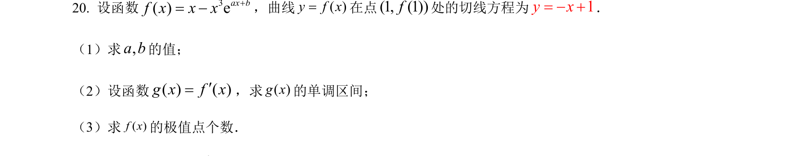
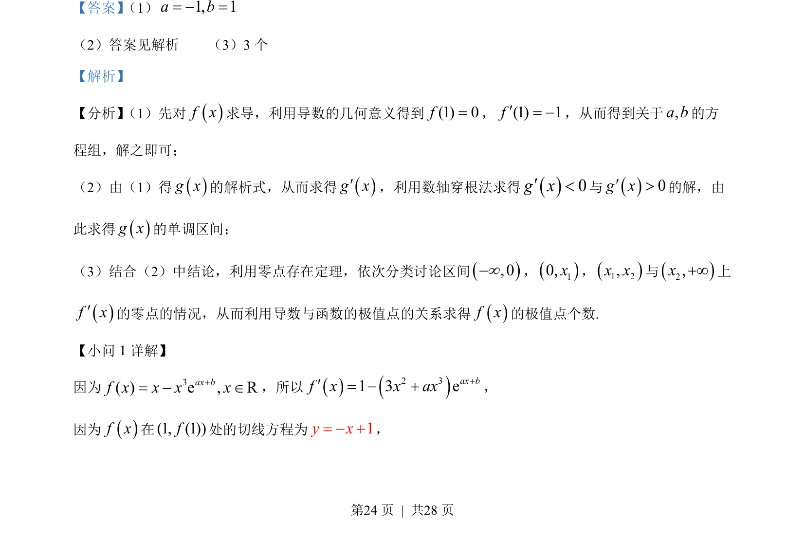
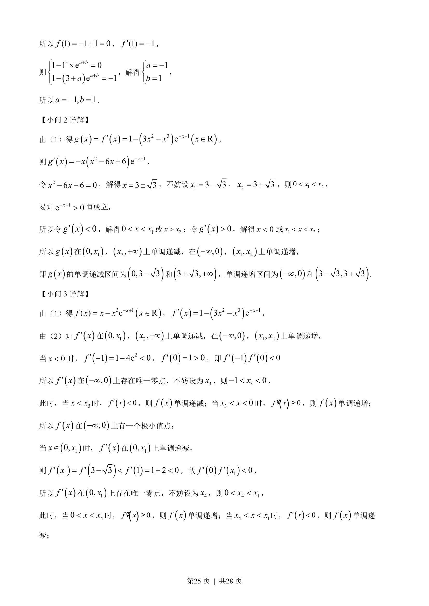
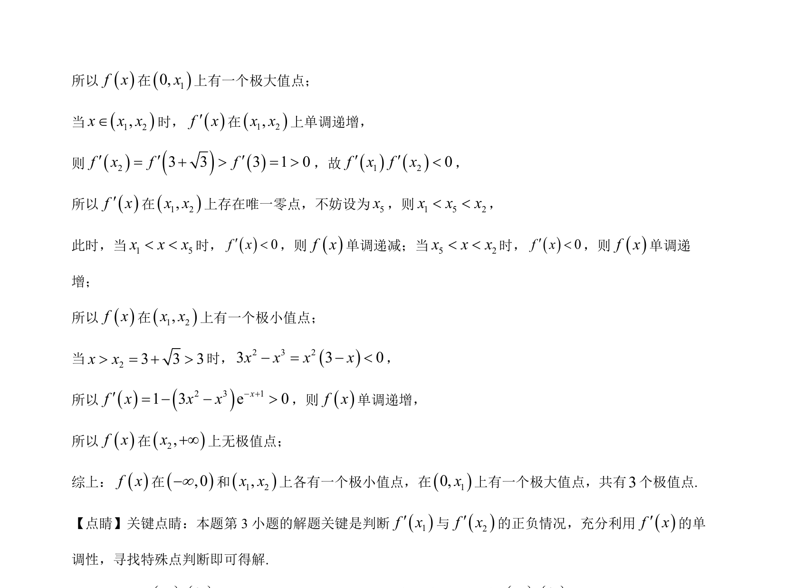

## 题面

## 摘要

考查导数几何意义求参数，进而求单调区间并讨论极值点个数。

## 关联考点

- [[440-导数的几何意义|导数的几何意义]]
- [[705-利用导数研究函数的单调性|利用导数研究函数的单调性]]
- [[1174-极值点|极值点]]
- [[1144-零点存在定理|零点存在定理]]

## 答案与解析

> 📄 原 PDF 第 24 页：`素材/真题/北京/2008-2024·（北京）数学高考真题/2023年高考数学试卷（北京）（解析卷）.pdf`
