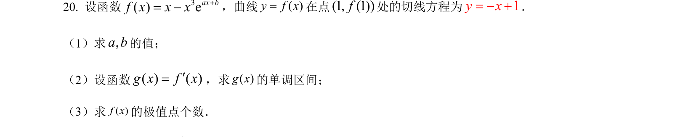
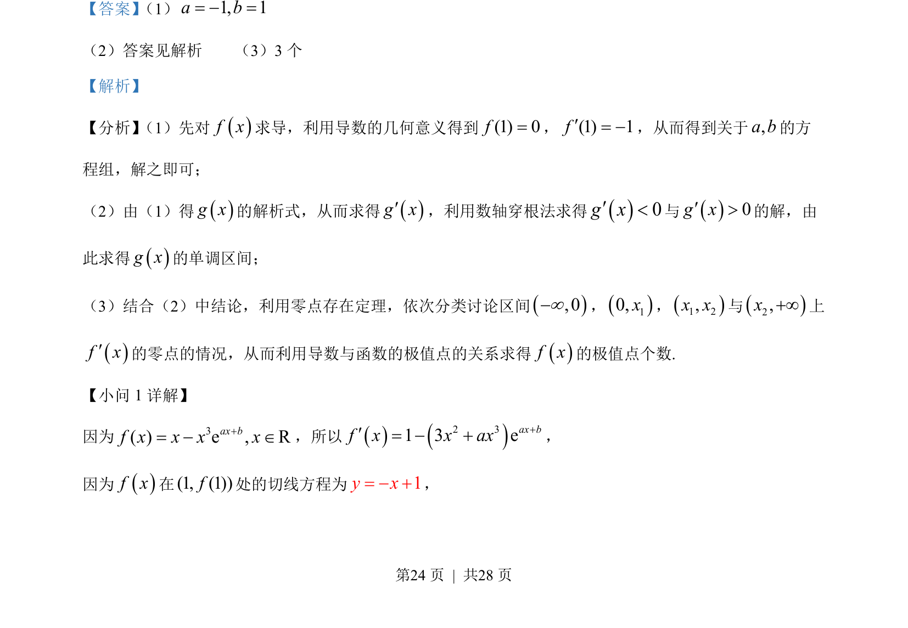
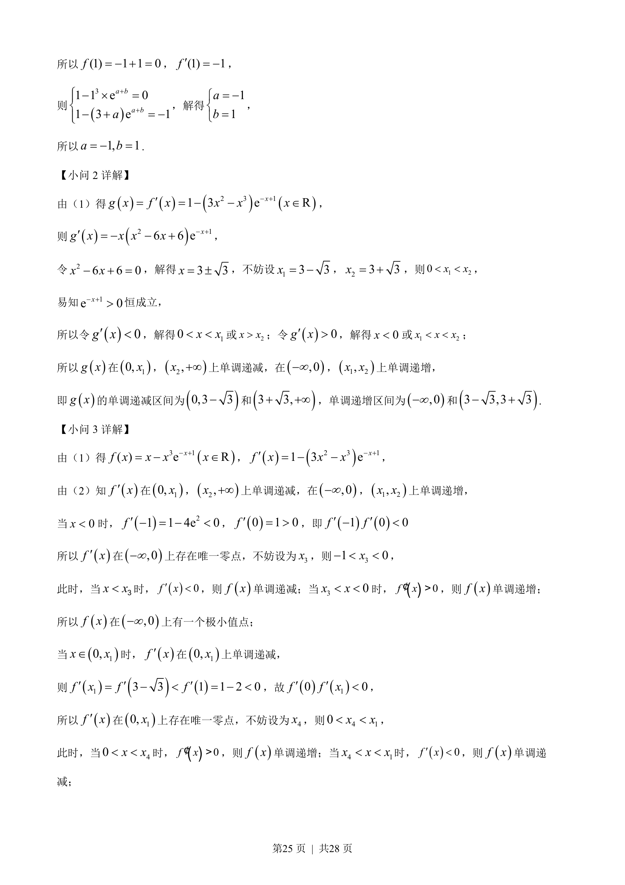
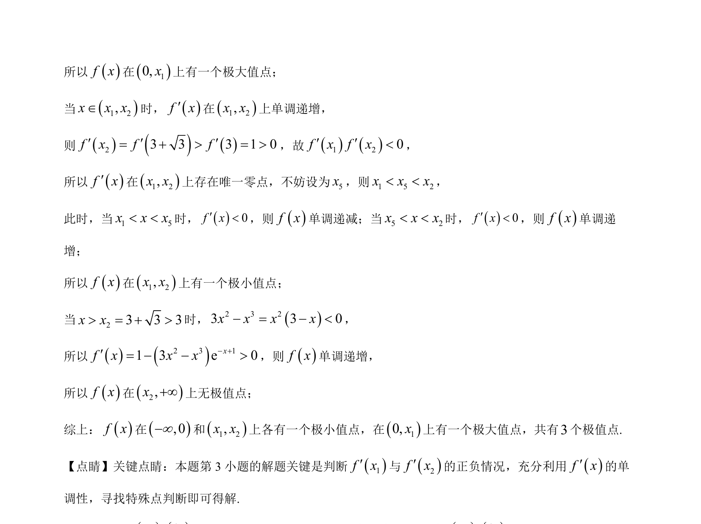

## 题面

## 摘要

考查导数几何意义求参数，进而求单调区间并讨论极值点个数。

## 关联考点

- [[440-导数的几何意义|导数的几何意义]]
- [[705-利用导数研究函数的单调性|利用导数研究函数的单调性]]
- [[1173-极值点|极值点]]
- [[1143-零点存在定理|零点存在定理]]

## 答案与解析

> 📄 原 PDF 第 24 页：`素材/真题/北京/2008-2024·（北京）数学高考真题/2023年高考数学试卷（北京）（解析卷）.pdf`

<!-- 题干文本-start -->
## 题干文本
20. 设函数 3( ) eax bf x x x+= -，曲线( )y f x=在点(1, (1))f处的切线方程为1y x= - +．
（1）求,a b的值；
（2）设函数( ) ( )g x f x¢=，求( )g x的单调区间；
（3）求( )f x的极值点个数．
<!-- 题干文本-end -->

<!-- 解析文本-start -->
## 解析文本
【答案】 （1）1, 1a b= - =    
（2）答案见解析    （3）3 个
【解析】
【分析】 （1）先对f x求导，利用导数的几何意义得到(1) 0f=，(1)1f¢=-，从而得到关于,a b的方
程组，解之即可；
（2）由（1）得g x的解析式，从而求得g x¢，利用数轴穿根法求得0g x¢<与0g x¢>的解，由
此求得g x的单调区间；
（3）结合（2）中结论，利用零点存在定理，依次分类讨论区间,0¥-，10,x，1 2,x x与2,x+¥上
f x¢的零点的情况，从而利用导数与函数的极值点的关系求得f x的极值点个数.
【小问 1 详解】
因为 3R( ) e,ax bf xxx x+= -Î，所以2 31 3 eax bf xax x++¢= -，
因为f x在(1, (1))f处的切线方程为1y x= - +，
<!-- 解析文本-end -->
