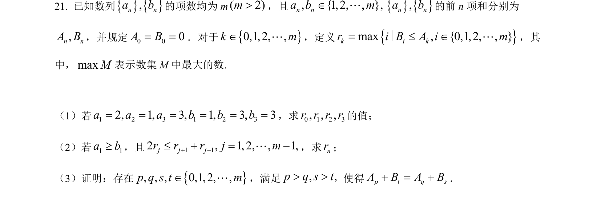
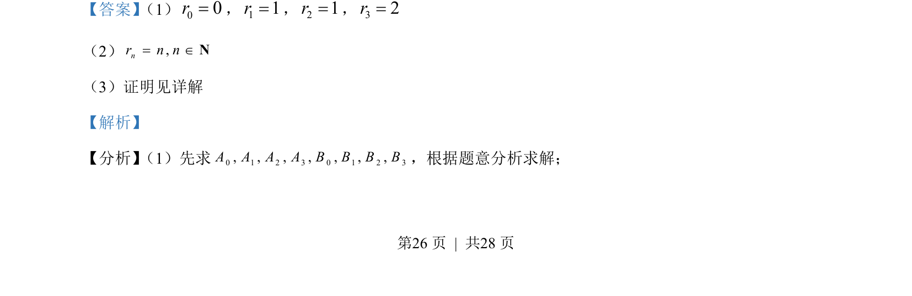
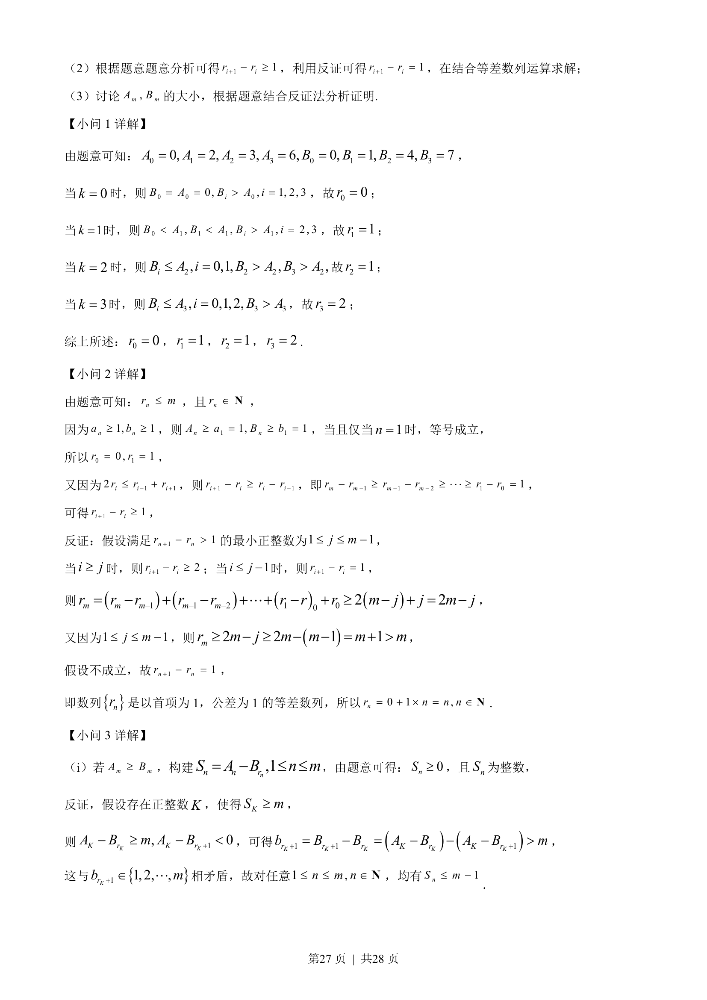
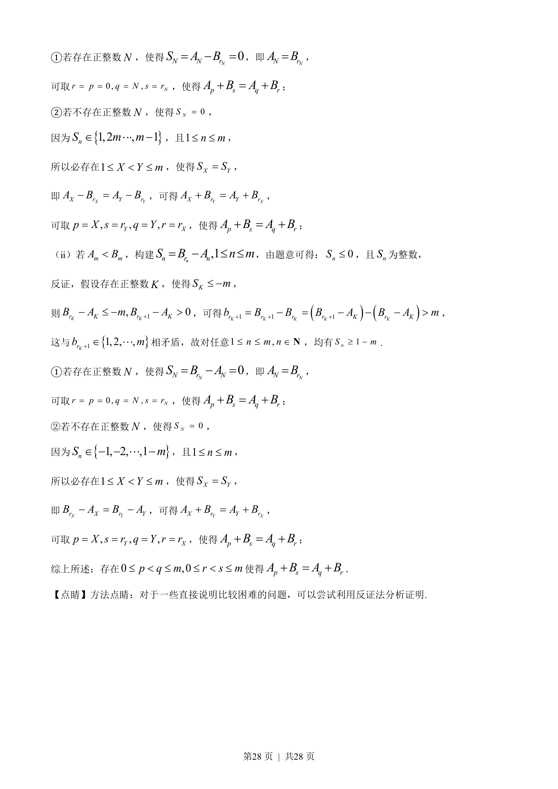

## 题面

## 摘要

本题通过自定义数列及下标规则，考查等差数列的判断、反证法证明及构造性推理。

## 关联考点

- [[381-数列概念-高中|数列]]
- [[356-等差数列概念|等差数列]]
- [[1180-反证法|反证法]]
- [[926-构造法|构造法]]

## 答案与解析

> 📄 原 PDF 第 26 页：`素材/真题/北京/2008-2024·（北京）数学高考真题/2023年高考数学试卷（北京）（解析卷）.pdf`
