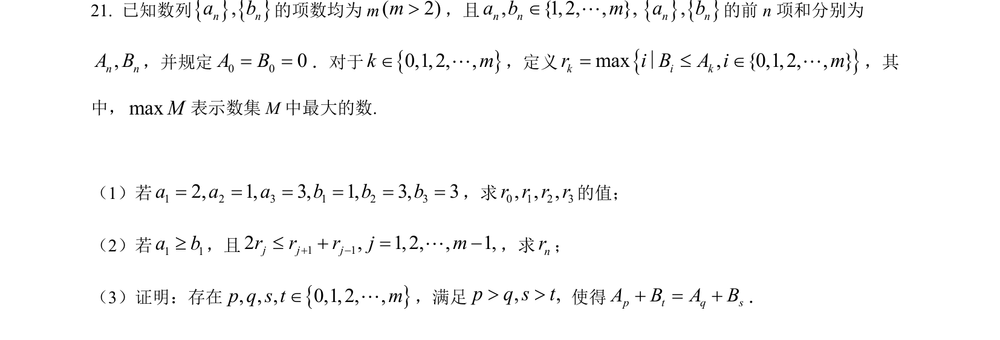
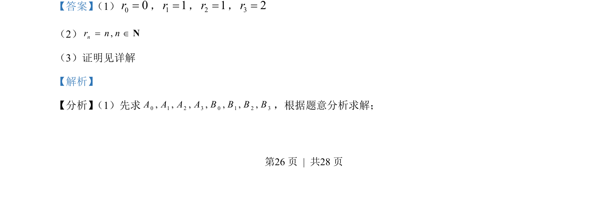
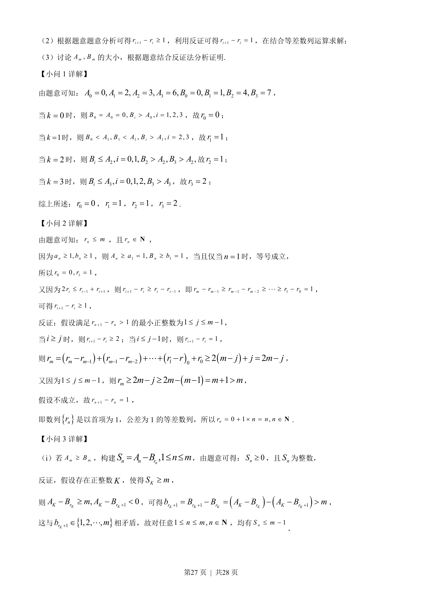
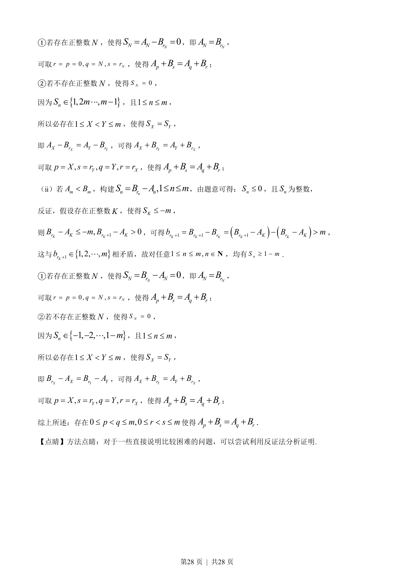

## 题面

## 摘要

本题通过自定义数列及下标规则，考查等差数列的判断、反证法证明及构造性推理。

## 关联考点

- [[381-数列概念-高中|数列]]
- [[356-等差数列概念|等差数列]]
- [[1179-反证法|反证法]]
- [[925-构造法|构造法]]

## 答案与解析

> 📄 原 PDF 第 26 页：`素材/真题/北京/2008-2024·（北京）数学高考真题/2023年高考数学试卷（北京）（解析卷）.pdf`

<!-- 题干文本-start -->
## 题干文本
21. 已知数列,n na b的项数均为 m( 2)m>，且, { 1, 2, , },n na b mÎL,n na b的前 n 项和分别为
,n nA B，并规定0 00A B= =．对于0,1, 2, ,k mÎL，定义max , {0,1, 2, , }k i kr i B A i m= £ Î∣L，其
中，maxM表示数集 M 中最大的数. 
（1）若1 2 3 1 2 32, 1, 3, 1, 3, 3a a a b b b= = = = = =，求0 1 2 3, , ,r r r r的值；
（2）若1 1a b³，且 1 12 , 1, 2, , 1,j jjr r r j m+ -£ + = -L，求nr；
（3）证明：存在, , , 0,1, 2, ,p q s t mÎL，满足, ,p q s t> > 使得 tpsqA B A B+ = +．
<!-- 题干文本-end -->

<!-- 解析文本-start -->
## 解析文本
【答案】 （1）00r=，11r=，21r=，32r=    
（2）,nr n n= ÎN    
（3）证明见详解
【解析】
【分析】 （1）先求0 1 2 3 0 1 2 3, , , , , , ,A A A A B B B B，根据题意分析求解；
<!-- 解析文本-end -->
