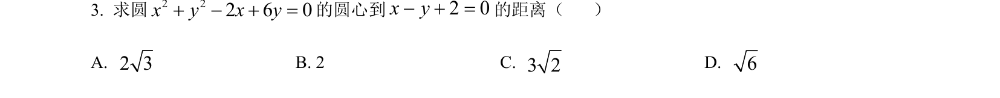
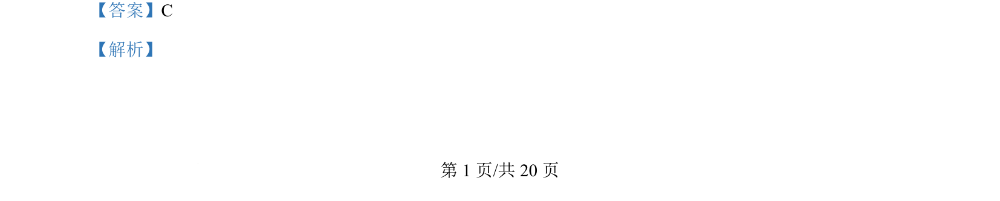
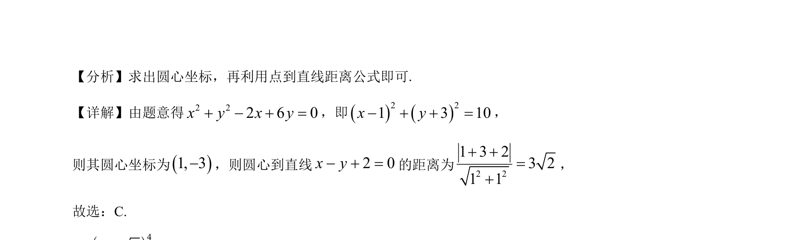

## 题面

## 摘要

考查圆的一般方程化为标准方程求圆心，并利用点到直线距离公式计算距离。

## 关联考点

- [[373-圆的标准方程|圆的标准方程]]
- [[圆心坐标]]
- [[392-点到直线距离公式|点到直线距离公式]]

## 答案与解析

> 📄 原 PDF 第 1 页：`素材/真题/北京/2008-2024·（北京）数学高考真题/2024年高考数学试卷（北京）（解析卷）.pdf`
