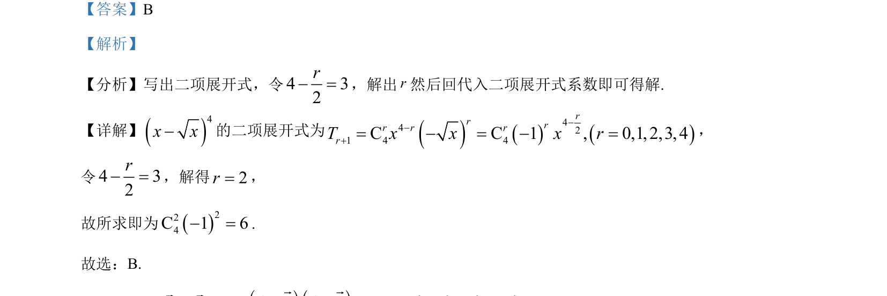

## 题面

## 摘要

二项式展开式中指定项系数的求解

## 关联考点

- [[472-二项式定理|二项式定理]]
- [[1160-展开式通项|展开式通项]]
- [[1362-系数计算|系数计算]]

## 答案与解析

> 📄 原 PDF 第 2 页：`素材/真题/北京/2008-2024·（北京）数学高考真题/2024年高考数学试卷（北京）（解析卷）.pdf`

<!-- 题干文本-start -->
## 题干文本
4. 4x x-的二项展开式中3x的系数为（    ）
A. 15 B. 6 C. 4-D. 13-
<!-- 题干文本-end -->

<!-- 解析文本-start -->
## 解析文本
【答案】B
【解析】
【分析】写出二项展开式，令4 32r- =，解出r然后回代入二项展开式系数即可得解.
【详解】4x x-的二项展开式为4421 4 4C C 1 , 0,1, 2,3, 4rrrr r rrT x x x r--+= - = - =，
令4 32r- =，解得2r=，
故所求即为224C 1 6- =.
故选：B.
<!-- 解析文本-end -->
