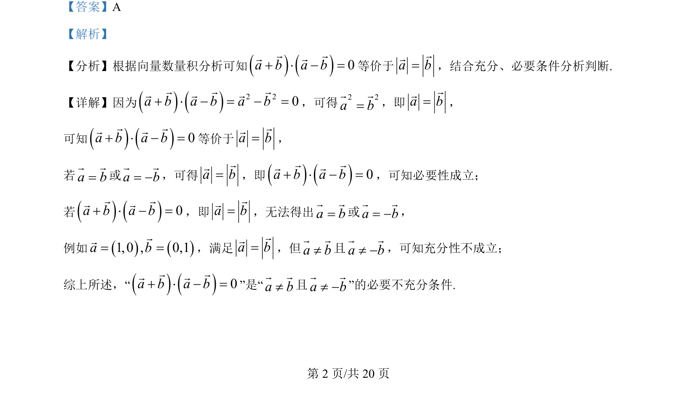

## 题面

## 摘要

本题通过向量数量积运算，考查充分条件与必要条件的逻辑判断，结合向量模的等价转化。

## 关联考点

- [[751-向量数量积|向量数量积]]
- [[752-向量模长|向量的模]]
- [[533-充分必要条件|充分必要条件]]

## 答案与解析

> 📄 原 PDF 第 2 页：`素材/真题/北京/2008-2024·（北京）数学高考真题/2024年高考数学试卷（北京）（解析卷）.pdf`
