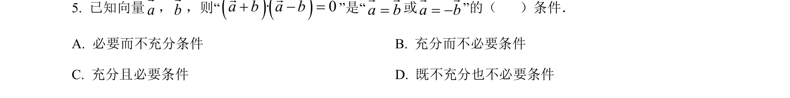
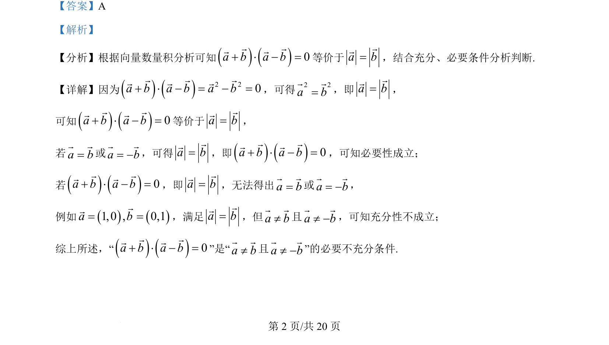

## 题面

## 摘要

本题通过向量数量积运算，考查充分条件与必要条件的逻辑判断，结合向量模的等价转化。

## 关联考点

- [[328-向量的数量积|向量数量积]]
- [[752-向量模长|向量的模]]
- [[533-充分必要条件|充分必要条件]]

## 答案与解析

> 📄 原 PDF 第 2 页：`素材/真题/北京/2008-2024·（北京）数学高考真题/2024年高考数学试卷（北京）（解析卷）.pdf`

<!-- 题干文本-start -->
## 题干文本
5. 已知向量ar
，br
，则“·0a b a b+ - =r rr r”是“a b=r r
或a b= -r r
”的（    ）条件．
A. 必要而不充分条件 B. 充分而不必要条件
C. 充分且必要条件 D. 既不充分也不必要条件
<!-- 题干文本-end -->

<!-- 解析文本-start -->
## 解析文本
【答案】A
【解析】
【分析】根据向量数量积分析可知0a b a b+ × - =r rr r等价于a b=rr，结合充分、必要条件分析判断.
【详解】因为2 20a b a b a b+ × - = - =r r rr r r，可得2 2a b=r r，即a b=rr，
可知0a b a b+ × - =r rr r等价于a b=rr，
若a b=r r
或a b= -r r
，可得a b=rr，即0a b a b+ × - =r rr r，可知必要性成立；
若0a b a b+ × - =r rr r，即a b=rr，无法得出a b=r r
或a b= -r r
，
例如1,0 , 0,1a b= =rr，满足a b=rr，但a b¹r r
且a b¹ -r r
，可知充分性不成立；
综上所述，“0a b a b+ × - =r rr r”是“a b¹r r
且a b¹ -r r
”的必要不充分条件.
<!-- 解析文本-end -->
