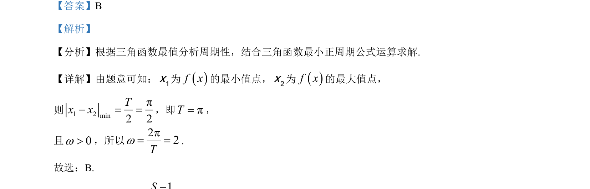

## 题面

## 摘要

该题通过三角函数的最值点关系分析周期性，结合最小正周期公式求解参数ω的值。

## 关联考点

- [[611-三角函数的周期性|三角函数周期性]]
- [[759-周期公式|最小正周期公式]]

## 答案与解析

> 📄 原 PDF 第 3 页：`素材/真题/北京/2008-2024·（北京）数学高考真题/2024年高考数学试卷（北京）（解析卷）.pdf`

<!-- 题干文本-start -->
## 题干文本
6. 已知sin 0f x xw w= >，11f x= -，21f x=，1 2 minπ| |2x x- =，则w=（    ）
A. 1 B. 2 C. 3 D. 4
<!-- 题干文本-end -->

<!-- 解析文本-start -->
## 解析文本
【答案】B
【解析】
【分析】根据三角函数最值分析周期性，结合三角函数最小正周期公式运算求解.
【详解】由题意可知：1x为f x的最小值点，2x为f x的最大值点，
则1 2minπ2 2Tx x- = =，即πT=，
且0w>，所以2π2Tw= =.
故选：B.
<!-- 解析文本-end -->
