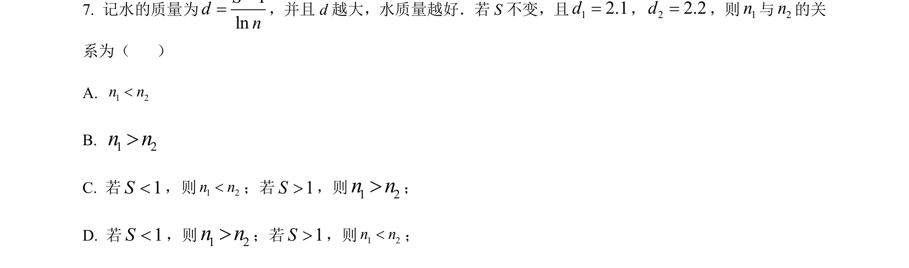
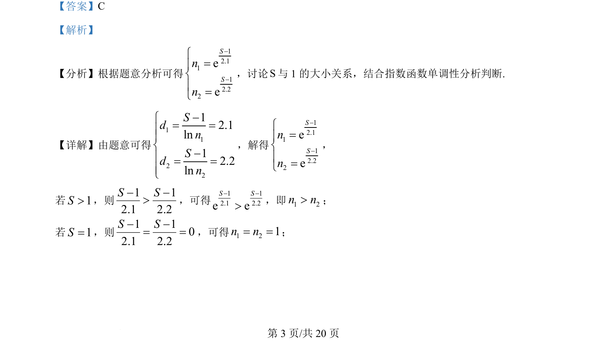
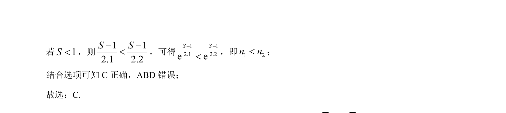

## 题面

## 摘要

考查指数函数单调性比较大小，需对参数分类讨论。

## 关联考点

- [[553-指数函数单调性|指数函数单调性]]
- [[424-参数分类讨论|分类讨论]]

## 答案与解析

> 📄 原 PDF 第 3 页：`素材/真题/北京/2008-2024·（北京）数学高考真题/2024年高考数学试卷（北京）（解析卷）.pdf`

<!-- 题干文本-start -->
## 题干文本
7. 记水的质量为1lnSdn-=，并且 d 越大，水质量越好．若 S 不变，且12.1d=，22.2d=，则1n与2n的关
系为（    ）
A. 1 2n n<
B. 1 2n n>
C. 若1S<，则1 2n n<；若1S>，则1 2n n>；
D. 若1S<，则1 2n n>；若1S>，则1 2n n<；
<!-- 题干文本-end -->

<!-- 解析文本-start -->
## 解析文本
【答案】C
【解析】
【分析】根据题意分析可得
12.1112.22eeSSnn--ì=ïíï=î
，讨论S与 1 的大小关系，结合指数函数单调性分析判断.
【详解】由题意可得
112212.1ln12.2lnSdnSdn-ì= =ïïí-ï= =ïî
，解得
12.1112.22eeSSnn--ì=ïíï=î
，
若1S>，则1 12.1 2.2S S- ->，可得1 12.1 2.2e eS S- ->，即1 2n n>；
若1S=，则1 102.1 2.2S S- -= =，可得1 21n n= =；
<!-- 解析文本-end -->
