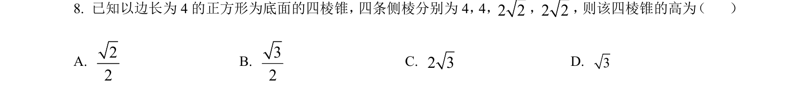
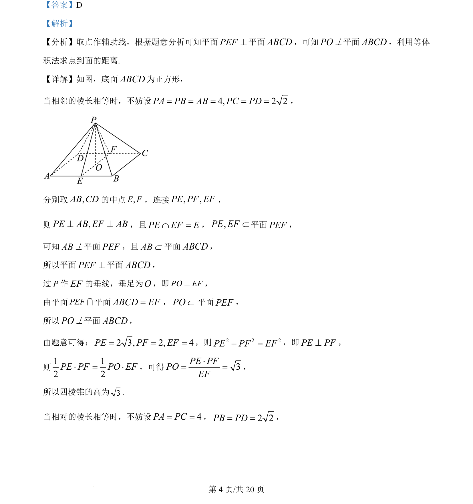
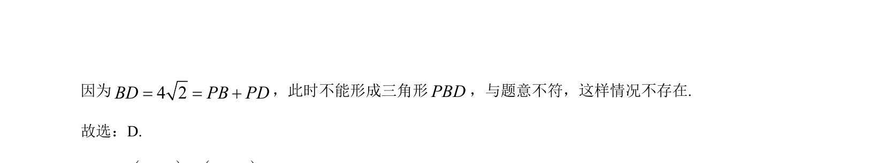

## 题面

## 摘要

本题考查四棱锥中利用线面垂直、面面垂直及等体积法求点到面的距离。

## 关联考点

- [[1086-线面垂直的判定与性质|线面垂直]]
- [[351-空间直线平面垂直|面面垂直]]
- [[等体积法求距离]]
- [[1045-空间几何体|空间几何体]]

## 答案与解析

> 📄 原 PDF 第 4 页：`素材/真题/北京/2008-2024·（北京）数学高考真题/2024年高考数学试卷（北京）（解析卷）.pdf`
