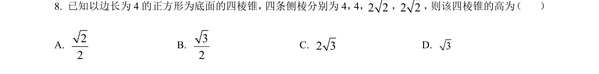
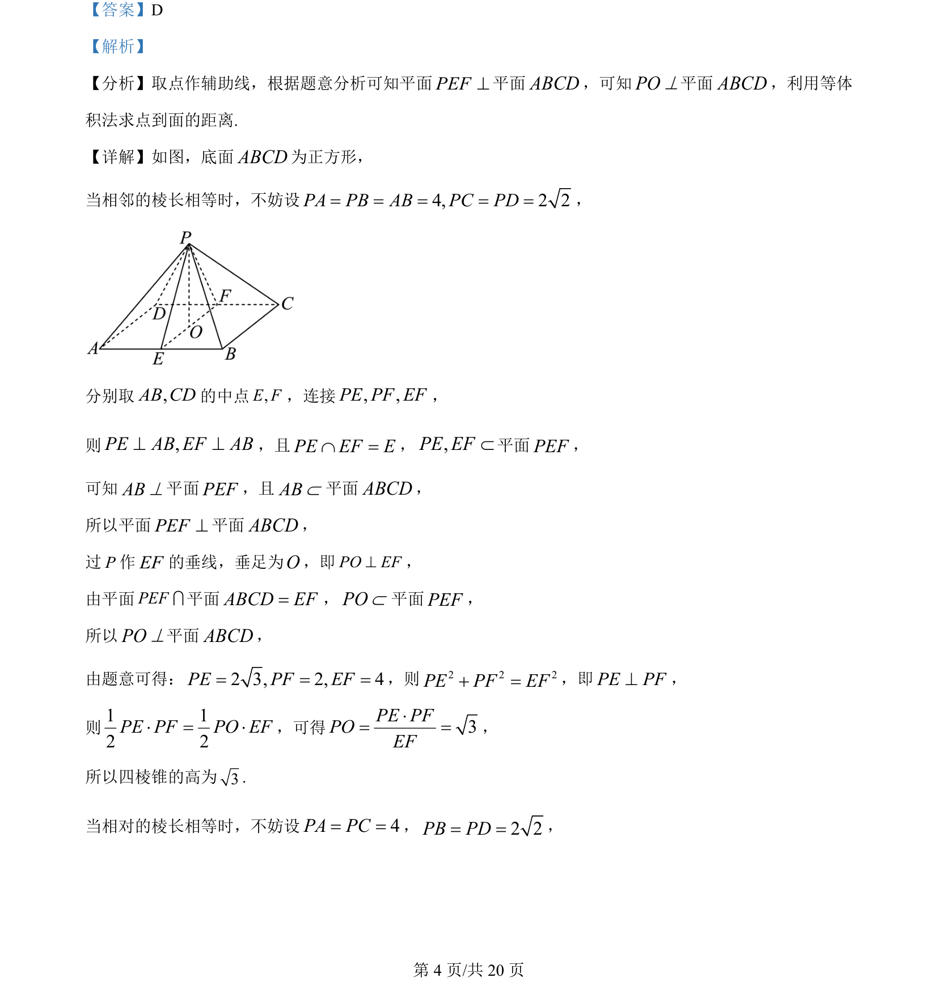
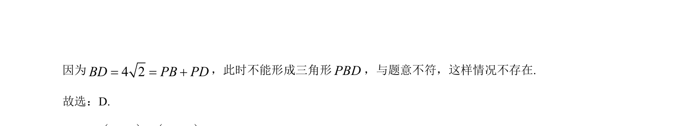

## 题面

## 摘要

本题考查四棱锥中利用线面垂直、面面垂直及等体积法求点到面的距离。

## 关联考点

- [[1086-线面垂直的判定与性质|线面垂直]]
- [[351-空间直线平面垂直|面面垂直]]
- [[等体积法求距离]]
- [[1045-空间几何体|空间几何体]]

## 答案与解析

> 📄 原 PDF 第 4 页：`素材/真题/北京/2008-2024·（北京）数学高考真题/2024年高考数学试卷（北京）（解析卷）.pdf`

<!-- 题干文本-start -->
## 题干文本
8. 已知以边长为 4 的正方形为底面的四棱锥， 四条侧棱分别为4，4，2 2，2 2， 则该四棱锥的高为 （    ）
A. 22
B. 32
C. 2 3D. 3
<!-- 题干文本-end -->

<!-- 解析文本-start -->
## 解析文本
【答案】D
【解析】
【分析】取点作辅助线，根据题意分析可知平面PEF^平面ABCD，可知PO^平面ABCD，利用等体
积法求点到面的距离.
【详解】如图，底面ABCD为正方形，
当相邻的棱长相等时，不妨设 4, 2 2PA PB AB PC PD= = = = =，
分别取,AB CD的中点,E F，连接, ,PE PF EF，
则,PE AB EF AB^ ^，且PE EF EÇ =，,PE EFÌ平面PEF，
可知AB^平面PEF，且ABÌ平面ABCD，
所以平面PEF^平面ABCD，
过P作EF的垂线，垂足为O，即PO EF^，
由平面PEFI平面ABCD EF=，POÌ平面PEF，
所以PO^平面ABCD，
由题意可得：2 3, 2, 4PE PF EF= = =，则2 2 2PE PF EF+ =，即PE PF^，
则1 12 2PE PF PO EF× = ×，可得 3PE PFPOEF×= =，
所以四棱锥的高为3.
当相对的棱长相等时，不妨设 4PA PC= =， 2 2PB PD= =，
<!-- 解析文本-end -->
