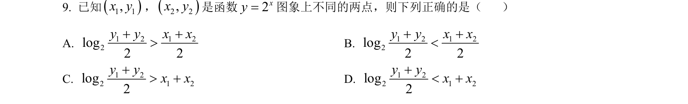
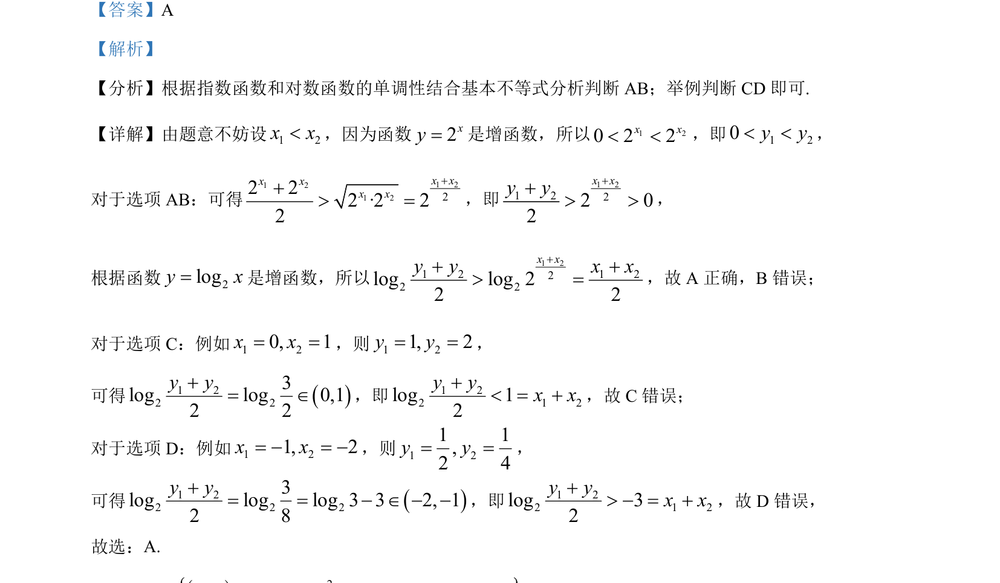

## 题面

## 摘要

利用指数函数、对数函数的单调性及基本不等式比较大小，并采用特例法判断选项正误。

## 关联考点

- [[553-指数函数单调性|指数函数单调性]]
- [[827-对数函数单调性|对数函数单调性]]
- [[295-基本不等式|基本不等式]]
- [[特例法]]

## 答案与解析

> 📄 原 PDF 第 5 页：`素材/真题/北京/2008-2024·（北京）数学高考真题/2024年高考数学试卷（北京）（解析卷）.pdf`
