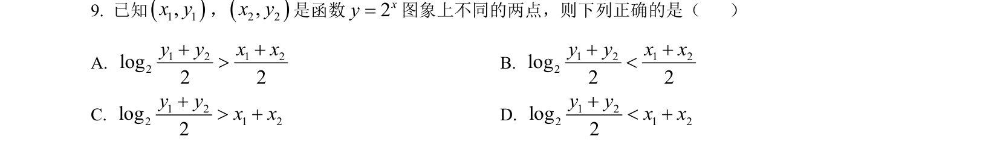
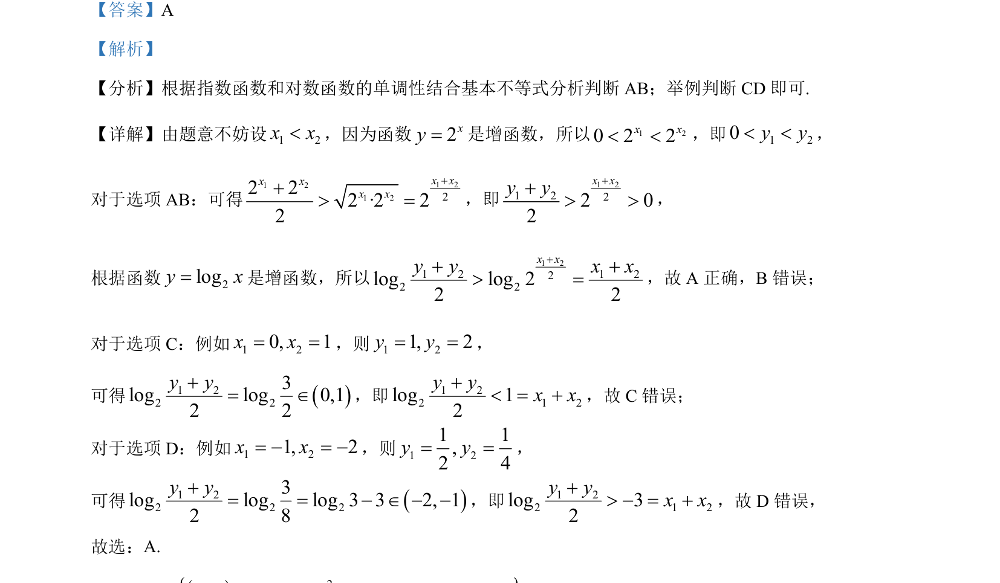

## 题面

## 摘要

利用指数函数、对数函数的单调性及基本不等式比较大小，并采用特例法判断选项正误。

## 关联考点

- [[553-指数函数单调性|指数函数单调性]]
- [[827-对数函数单调性|对数函数单调性]]
- [[295-基本不等式|基本不等式]]
- [[特例法]]

## 答案与解析

> 📄 原 PDF 第 5 页：`素材/真题/北京/2008-2024·（北京）数学高考真题/2024年高考数学试卷（北京）（解析卷）.pdf`

<!-- 题干文本-start -->
## 题干文本
9. 已知()1 1,x y，()2 2,x y是函数2xy=图象上不同的两点，则下列正确的是（    ）
A. 1 2 1 22log2 2y y x x+ +>B. 1 2 1 22log2 2y y x x+ +<
C. 1 22 1 2log2y yx x+> +D. 1 22 1 2log2y yx x+< +
<!-- 题干文本-end -->

<!-- 解析文本-start -->
## 解析文本
【答案】A
【解析】
【分析】根据指数函数和对数函数的单调性结合基本不等式分析判断 AB；举例判断 CD 即可.
【详解】由题意不妨设12xx<，因为函数2xy=是增函数，所以 1 20 2 2x x< <，即1 20y y< <，
对于选项 AB：可得
1 21 21 222 22 ·2 22x xx xx x++> =，即
1 21 222 02x xy y++> >，
根据函数 2logy x=是增函数，所以
1 21 2 1 222 2log log 22 2x xy y x x++ +> =，故 A 正确，B错误；
对于选项 C：例如1 20, 1x x= =，则1 21, 2y y= =，
可得 ()1 22 23log log 0,12 2y y+= Î，即 1 22 1 2log 12y yx x+< = +，故 C错误；
对于选项 D：例如1 21, 2x x= - = -，则1 21 1,2 4y y= =，
可得 ()1 22 2 23log log log 3 3 2, 12 8y y+= = - Î - -，即 1 22 1 2log 32y yx x+> - = +，故 D 错误，
故选：A.
<!-- 解析文本-end -->
