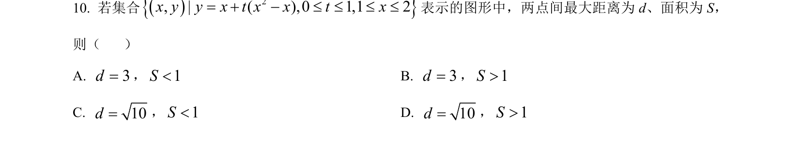
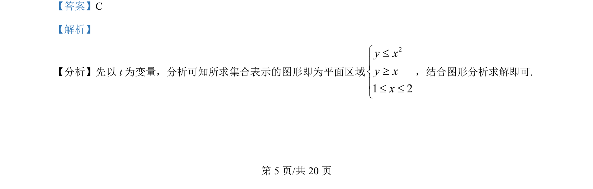
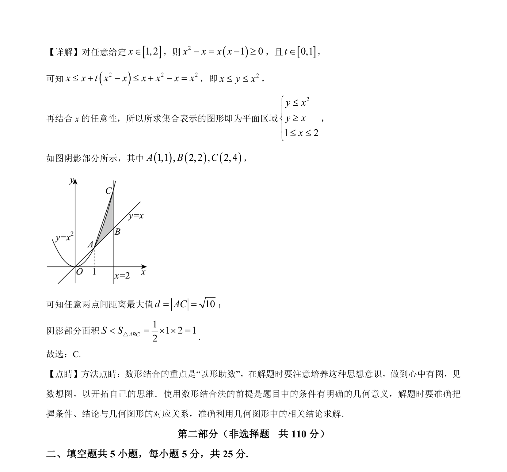

## 题面

## 摘要

集合表示的平面区域分析，结合数形结合求阴影部分面积与两点间最大距离。

## 关联考点

- [[集合表示]]
- [[852-平面区域|平面区域]]
- [[897-数形结合|数形结合]]
- [[979-点到点距离|两点间距离]]

## 答案与解析

> 📄 原 PDF 第 5 页：`素材/真题/北京/2008-2024·（北京）数学高考真题/2024年高考数学试卷（北京）（解析卷）.pdf`
