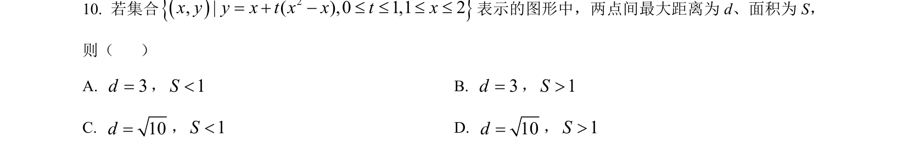
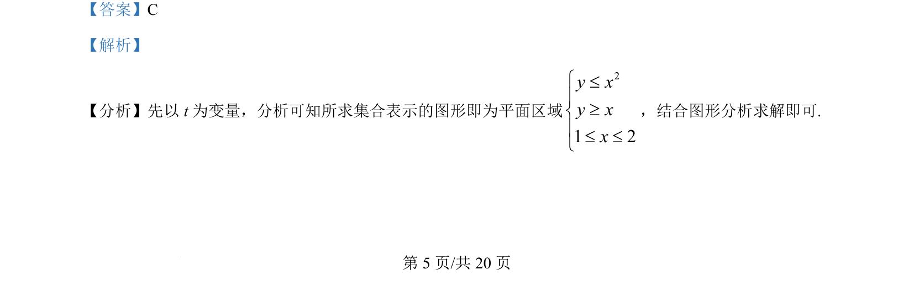
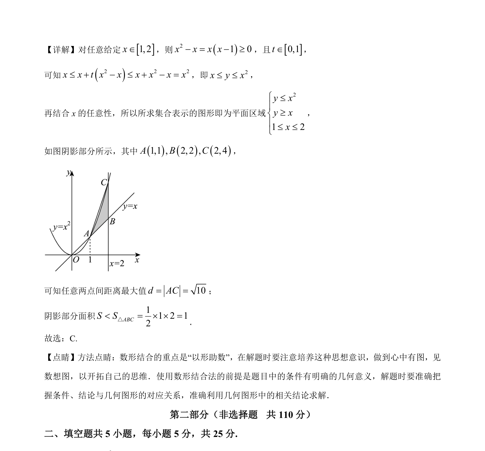

## 题面

## 摘要

集合表示的平面区域分析，结合数形结合求阴影部分面积与两点间最大距离。

## 关联考点

- [[集合表示]]
- [[852-平面区域|平面区域]]
- [[897-数形结合|数形结合]]
- [[979-点到点距离|两点间距离]]

## 答案与解析

> 📄 原 PDF 第 5 页：`素材/真题/北京/2008-2024·（北京）数学高考真题/2024年高考数学试卷（北京）（解析卷）.pdf`

<!-- 题干文本-start -->
## 题干文本
10. 若集合(){}2, | ( ),0 1,1 2x y y x t x x t x= + - £ £ £ £表示的图形中，两点间最大距离为 d、面积为 S，
则（    ）
A. 3d=，1S<B. 3d=，1S>
C. 10d=，1S<D. 10d=，1S>
<!-- 题干文本-end -->

<!-- 解析文本-start -->
## 解析文本
【答案】C
【解析】
【分析】先以 t为变量，分析可知所求集合表示的图形即为平面区域
21 2y xy xxì£ï³íï£ £î
，结合图形分析求解即可.
<!-- 解析文本-end -->
