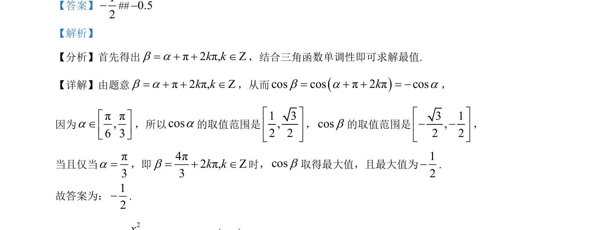

## 题面

## 摘要

通过角度关系转换余弦函数，结合给定区间求余弦函数最值。

## 关联考点

- [[1249-三角函数的诱导公式|诱导公式]]
- [[余弦函数的值域]]
- [[607-三角函数最值|三角函数最值]]

## 答案与解析

> 📄 原 PDF 第 7 页：`素材/真题/北京/2008-2024·（北京）数学高考真题/2024年高考数学试卷（北京）（解析卷）.pdf`
