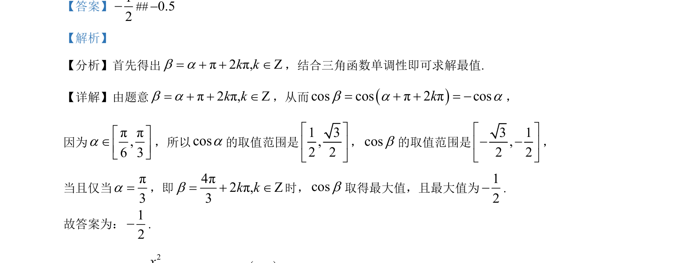

## 题面

## 摘要

通过角度关系转换余弦函数，结合给定区间求余弦函数最值。

## 关联考点

- [[1249-三角函数的诱导公式|诱导公式]]
- [[余弦函数的值域]]
- [[615-三角函数的最值|三角函数最值]]

## 答案与解析

> 📄 原 PDF 第 7 页：`素材/真题/北京/2008-2024·（北京）数学高考真题/2024年高考数学试卷（北京）（解析卷）.pdf`

<!-- 题干文本-start -->
## 题干文本
12. 已知
ππ,6 3aé ùÎê úë û
，且 α与 β 的终边关于原点对称，则cosb的最大值为________．
<!-- 题干文本-end -->

<!-- 解析文本-start -->
## 解析文本
【答案】12-##0.5-
【解析】
【分析】首先得出π2π, Zk kb a= + + Î，结合三角函数单调性即可求解最值.
【详解】由题意π2π, Zk kb a= + + Î，从而cos cosπ2πcoskb a a= + + = -，
因为
ππ,6 3aé ùÎê úë û
，所以cosa的取值范围是
1 3,2 2é ùê úë û
，cosb的取值范围是3 1,2 2é ù- -ê úë û
，
当且仅当π3a=，即4π2π, Z3k kb= + Î时，cosb取得最大值，且最大值为12-.
故答案为：12-.
<!-- 解析文本-end -->
