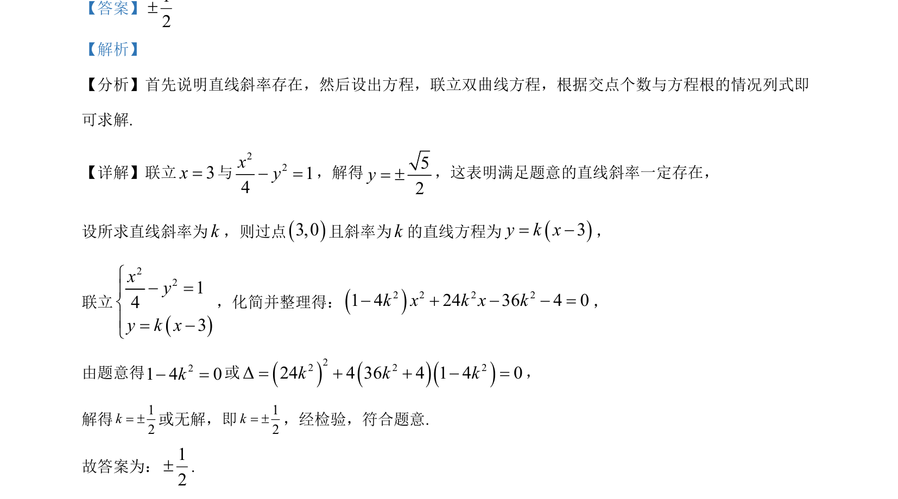

## 题面

## 摘要

考查直线与双曲线位置关系，通过联立方程利用判别式求解斜率。

## 关联考点

- [[1001-直线与双曲线位置关系|直线与双曲线位置关系]]
- [[229-根的判别式|判别式]]
- [[斜率存在性]]

## 答案与解析

> 📄 原 PDF 第 7 页：`素材/真题/北京/2008-2024·（北京）数学高考真题/2024年高考数学试卷（北京）（解析卷）.pdf`
