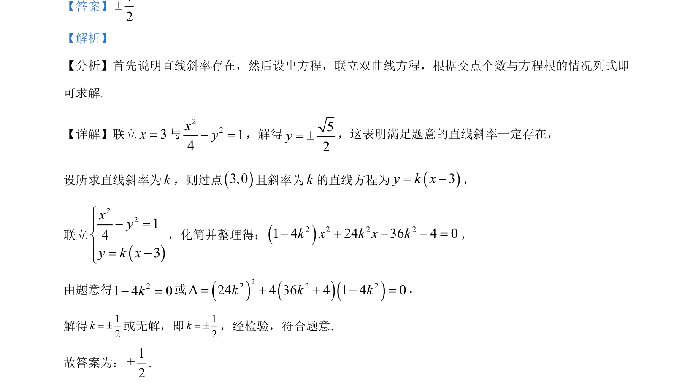

## 题面

## 摘要

考查直线与双曲线位置关系，通过联立方程利用判别式求解斜率。

## 关联考点

- [[1001-直线与双曲线位置关系|直线与双曲线位置关系]]
- [[229-根的判别式|判别式]]
- [[斜率存在性]]

## 答案与解析

> 📄 原 PDF 第 7 页：`素材/真题/北京/2008-2024·（北京）数学高考真题/2024年高考数学试卷（北京）（解析卷）.pdf`

<!-- 题干文本-start -->
## 题干文本
13. 已知双曲线
2214xy- =，则过()3,0且和双曲线只有一个交点的直线的斜率为________．
<!-- 题干文本-end -->

<!-- 解析文本-start -->
## 解析文本
【答案】12±
【解析】
【分析】首先说明直线斜率存在，然后设出方程，联立双曲线方程，根据交点个数与方程根的情况列式即
可求解.
【详解】联立3x=与
2214xy- =，解得52y= ±，这表明满足题意的直线斜率一定存在，
设所求直线斜率为k，则过点()3,0且斜率为k的直线方程为()3y k x= -，
联立
()22143xyy k xì- =ïíï= -î
，化简并整理得：()2 2 2 21 4 24 36 4 0k x k x k- + - - =，
由题意得 21 4 0k- =或()()()22 2 2Δ24 4 36 4 1 4 0k k k= + + - =，
解得12k= ±或无解，即12k= ±，经检验，符合题意.
故答案为：12±.
<!-- 解析文本-end -->
