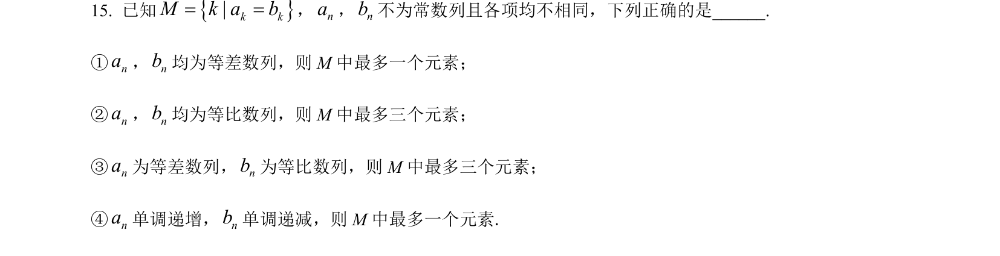
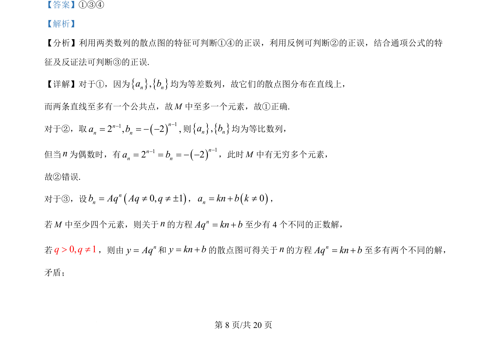
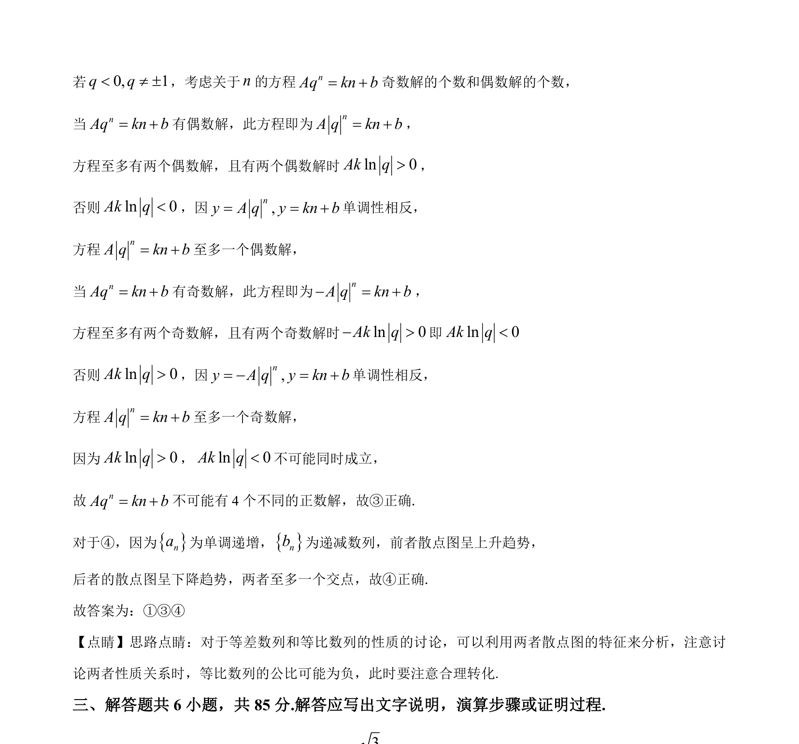

## 题面

## 摘要

本题通过散点图和方程解的情况，判断等差数列与等比数列公共项构成的集合中元素个数相关命题的真假。

## 关联考点

- [[356-等差数列概念|等差数列]]
- [[1067-等比数列的定义与通项公式|等比数列]]
- [[488-散点图|散点图]]
- [[1179-反证法|反证法]]

## 答案与解析

> 📄 原 PDF 第 8 页：`素材/真题/北京/2008-2024·（北京）数学高考真题/2024年高考数学试卷（北京）（解析卷）.pdf`
