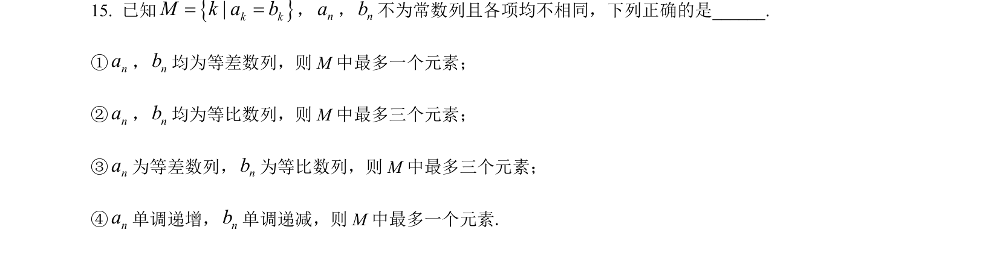
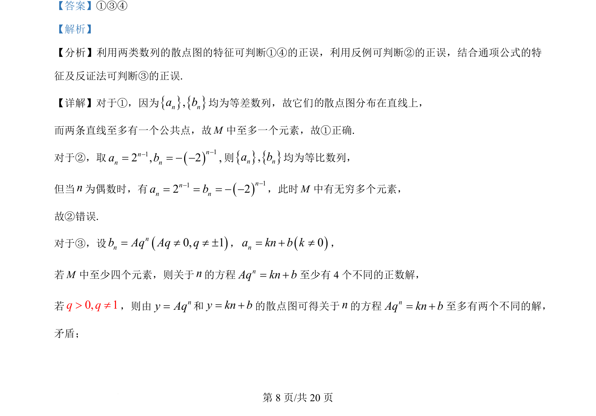
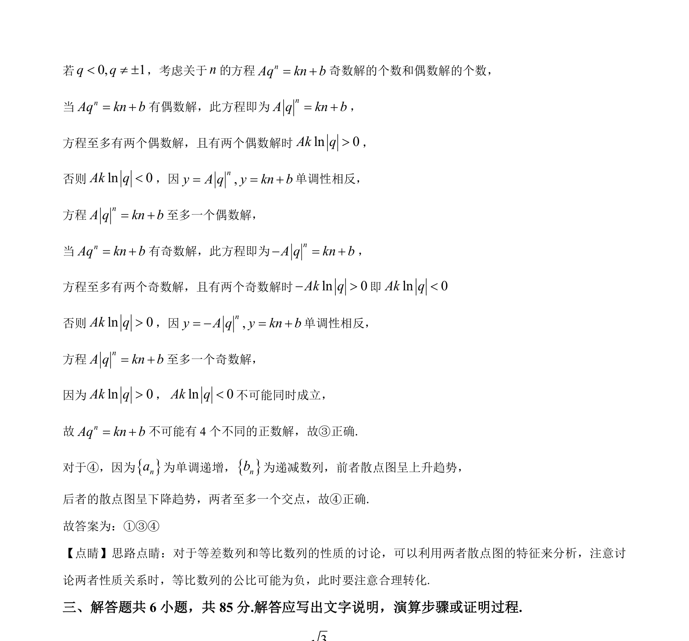

## 题面

## 摘要

本题通过散点图和方程解的情况，判断等差数列与等比数列公共项构成的集合中元素个数相关命题的真假。

## 关联考点

- [[356-等差数列概念|等差数列]]
- [[1067-等比数列的定义与通项公式|等比数列]]
- [[488-散点图|散点图]]
- [[1179-反证法|反证法]]

## 答案与解析

> 📄 原 PDF 第 8 页：`素材/真题/北京/2008-2024·（北京）数学高考真题/2024年高考数学试卷（北京）（解析卷）.pdf`

<!-- 题干文本-start -->
## 题干文本
15. 已知|k kM k a b= =，na，nb不为常数列且各项均不相同，下列正确的是______.
①na，nb均为等差数列，则 M 中最多一个元素；
②na，nb均为等比数列，则 M 中最多三个元素；
③na为等差数列，nb为等比数列，则 M 中最多三个元素；
④na单调递增，nb单调递减，则 M 中最多一个元素.
<!-- 题干文本-end -->

<!-- 解析文本-start -->
## 解析文本
【答案】①③④
【解析】
【分析】利用两类数列的散点图的特征可判断①④的正误，利用反例可判断②的正误，结合通项公式的特
征及反证法可判断③的正误.
【详解】对于①，因为,n na b均为等差数列，故它们 散点图分布在直线上，
而两条直线至多有一个公共点，故M中至多一个元素，故①正确.
对于②，取 112 , 2 ,nnn na b--= = - -则,n na b均为等比数列，
但当n为偶数时，有 112 2nnn na b--= = = - -，此时M中有无穷多个元素，
故②错误.
对于③，设0, 1nnb Aq Aq q= ¹ ¹ ±，0na kn b k= + ¹，
若M中至少四个元素，则关于n的方程nAq kn b= +至少有 4 个不同的正数解，
若0, 1q q> ¹，则由 ny Aq=和y kn b= +的散点图可得关于n的方程nAq kn b= +至多有两个不同的解，
矛盾；
的
<!-- 解析文本-end -->
