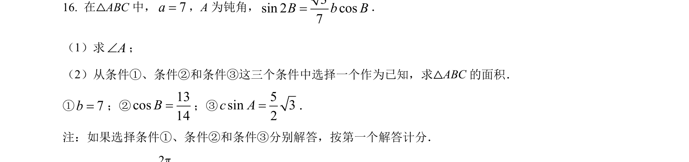
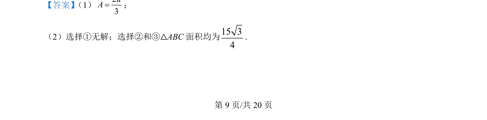
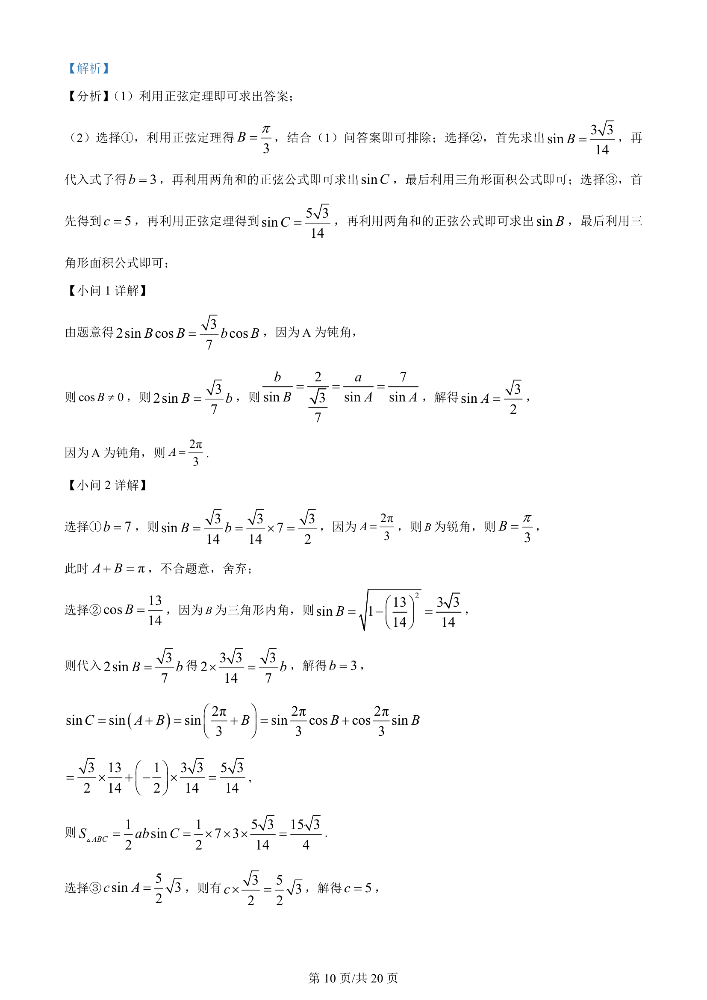
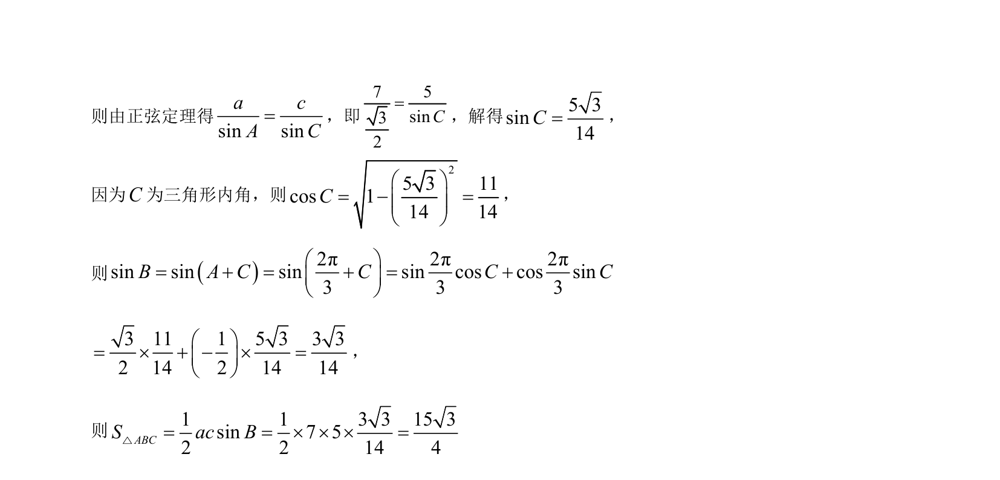

## 题面

## 摘要

本题考查解三角形，利用正弦定理和两角和公式求解角度与三角形面积。

## 关联考点

- [[126-定理|正弦定理]]
- [[634-两角和的正弦公式|两角和的正弦公式]]
- [[619-三角形面积公式|三角形面积公式]]
- [[589-解三角形|解三角形]]

## 答案与解析

> 📄 原 PDF 第 9 页：`素材/真题/北京/2008-2024·（北京）数学高考真题/2024年高考数学试卷（北京）（解析卷）.pdf`
