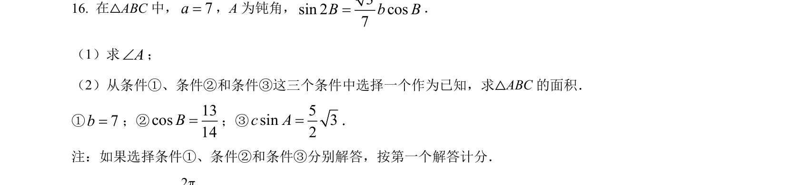
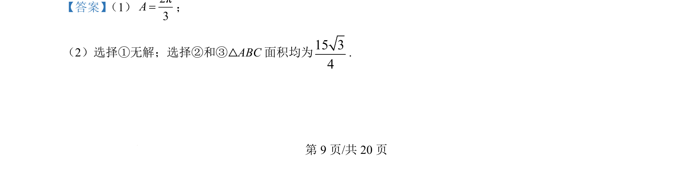
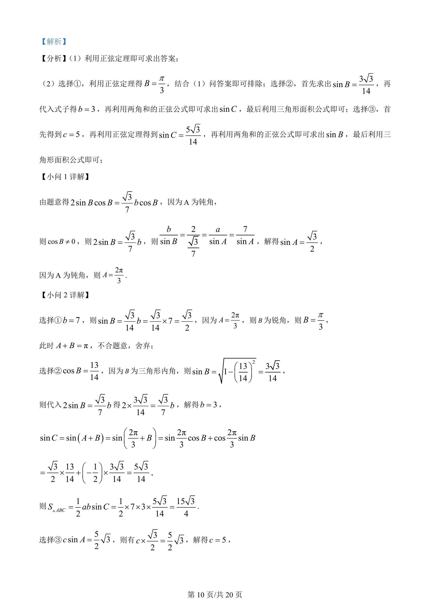
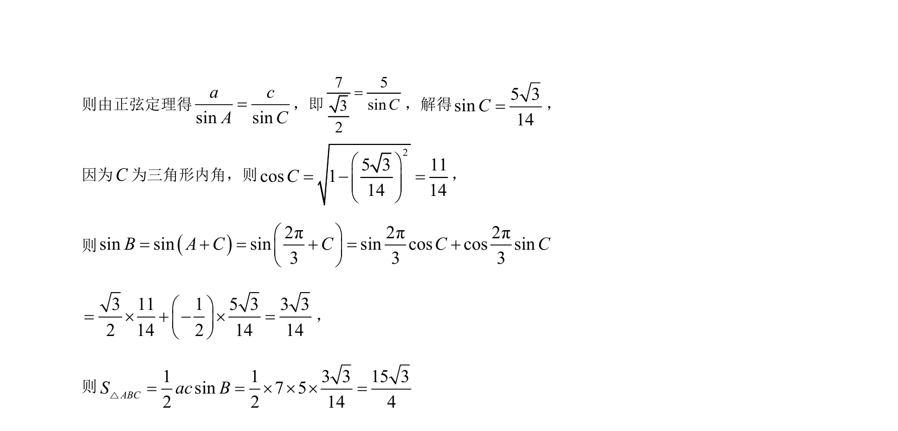

## 题面

## 摘要

本题考查解三角形，利用正弦定理和两角和公式求解角度与三角形面积。

## 关联考点

- [[126-定理|正弦定理]]
- [[634-两角和的正弦公式|两角和的正弦公式]]
- [[619-三角形面积公式|三角形面积公式]]
- [[589-解三角形|解三角形]]

## 答案与解析

> 📄 原 PDF 第 9 页：`素材/真题/北京/2008-2024·（北京）数学高考真题/2024年高考数学试卷（北京）（解析卷）.pdf`

<!-- 题干文本-start -->
## 题干文本
16. 在△ABC中，7a=，A为钝角， 3sin 2 cos7B b B=．
（1）求AÐ；
（2）从条件①、条件②和条件③这三个条件中选择一个作为已知，求△ABC的面积．
①7b=；②13cos14B=；③5sin 32c A=．
注：如果选择条件①、条件②和条件③分别解答，按第一个解答计分．
<!-- 题干文本-end -->

<!-- 解析文本-start -->
## 解析文本
【答案】 （1）2π3A=；    
（2）选择①无解；选择②和③△ABC面积均为15 34
.
的
<!-- 解析文本-end -->
