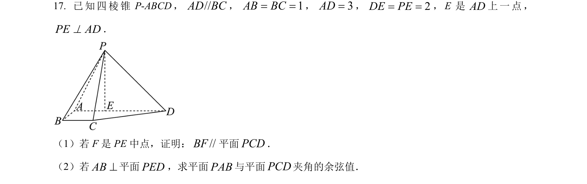
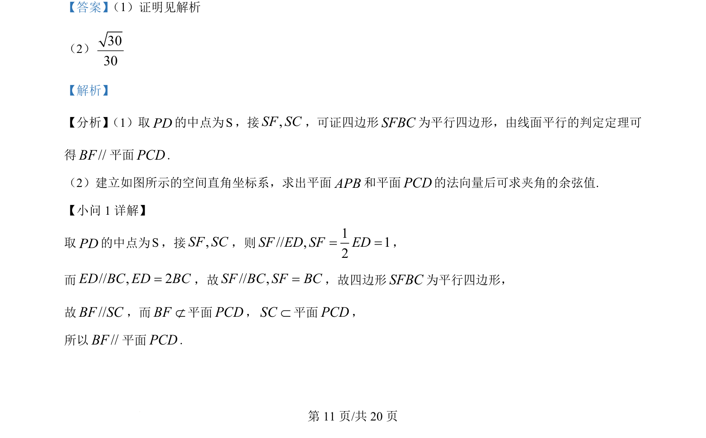
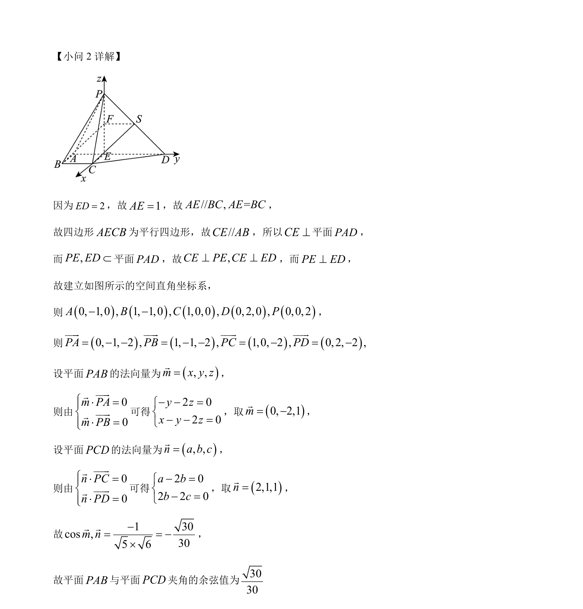

## 题面

## 摘要

证明线面平行及利用空间向量求二面角的余弦值。

## 关联考点

- [[1393-线面平行判定定理|线面平行判定定理]]
- [[399-空间向量坐标表示|空间直角坐标系]]
- [[411-空间平面法向量|法向量]]
- [[353-空间角|二面角]]

## 答案与解析

> 📄 原 PDF 第 11 页：`素材/真题/北京/2008-2024·（北京）数学高考真题/2024年高考数学试卷（北京）（解析卷）.pdf`
