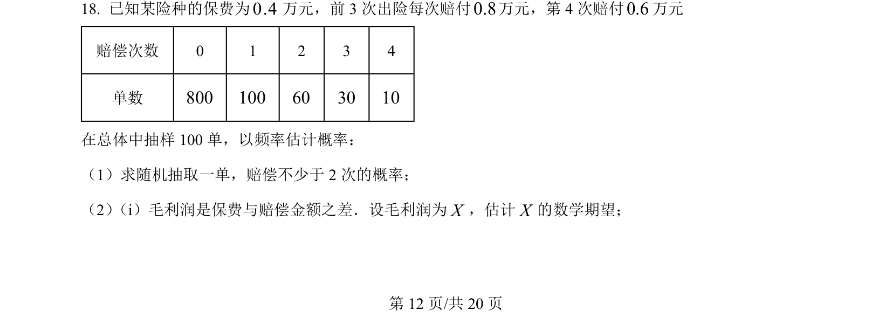
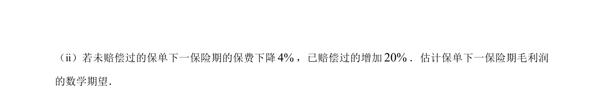
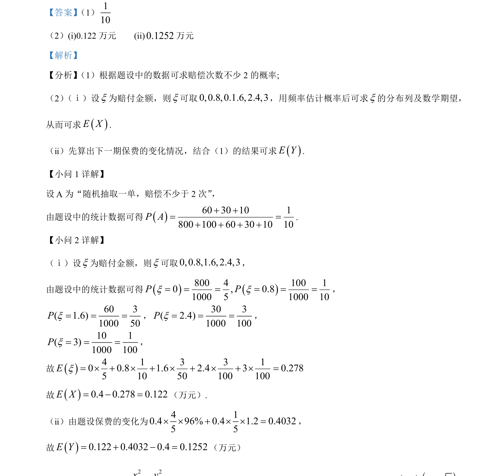

## 题面

## 摘要

考查根据统计数据计算概率、求随机变量的分布列与数学期望。

## 关联考点

- [[1188-频率估计概率|频率估计概率]]
- [[1331-离散型随机变量及其分布列|分布列]]
- [[1040-离散型随机变量的期望|数学期望]]

## 答案与解析

> 📄 原 PDF 第 12 页：`素材/真题/北京/2008-2024·（北京）数学高考真题/2024年高考数学试卷（北京）（解析卷）.pdf`
