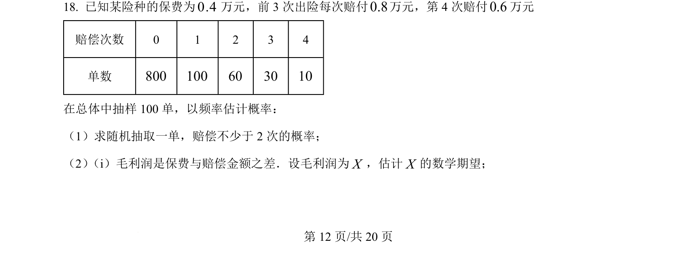
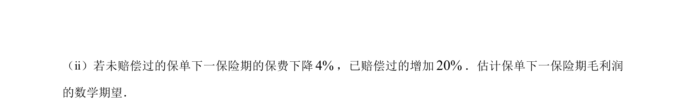
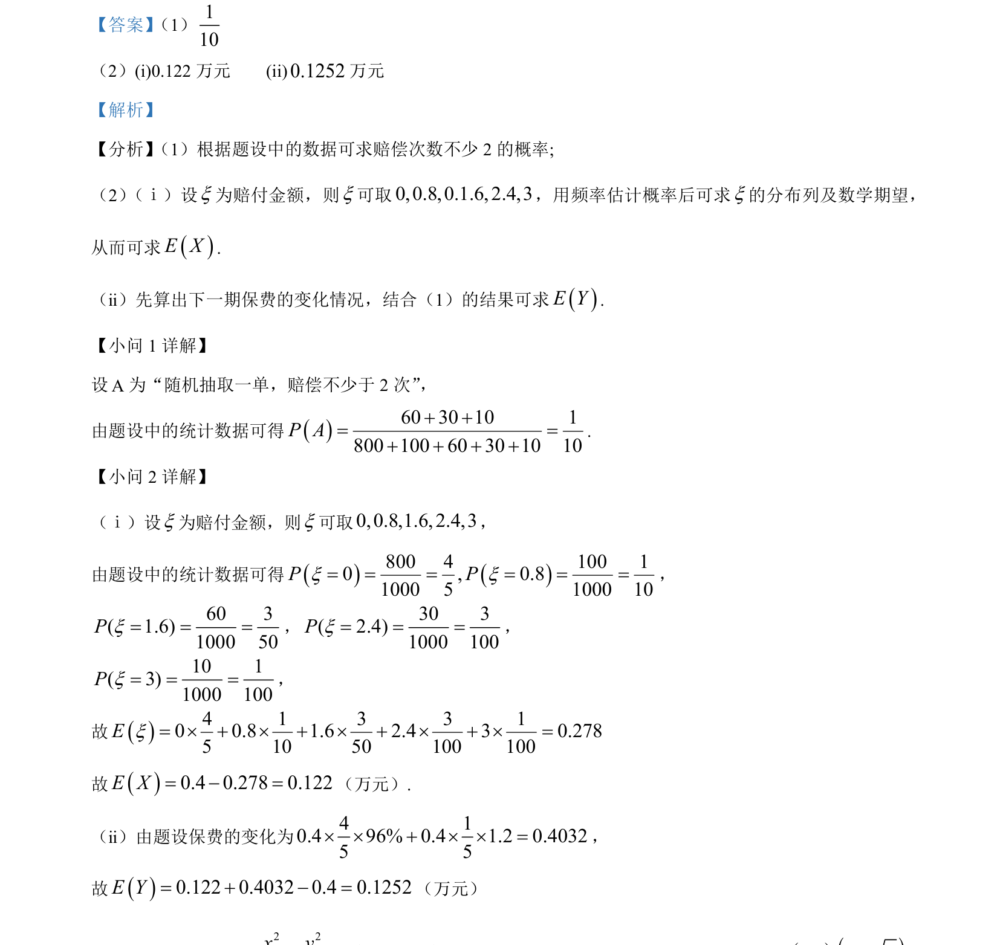

## 题面

## 摘要

考查根据统计数据计算概率、求随机变量的分布列与数学期望。

## 关联考点

- [[1187-频率估计概率|频率估计概率]]
- [[1330-离散型随机变量及其分布列|分布列]]
- [[501-离散型随机变量期望|数学期望]]

## 答案与解析

> 📄 原 PDF 第 12 页：`素材/真题/北京/2008-2024·（北京）数学高考真题/2024年高考数学试卷（北京）（解析卷）.pdf`

<!-- 题干文本-start -->
## 题干文本
18. 已知某险种的保费为0.4万元，前 3 次出险每次赔付0.8万元，第 4 次赔付0.6万元
赔偿次数 0 1 2 3 4
单数800100603010
在总体中抽样 100 单，以频率估计概率：
（1）求随机抽取一单，赔偿不少于 2 次的概率；
（2） （i）毛利润是保费与赔偿金额之差．设毛利润为X，估计X的数学期望；
<!-- 题干文本-end -->

<!-- 解析文本-start -->
## 解析文本

<!-- 解析文本-end -->
