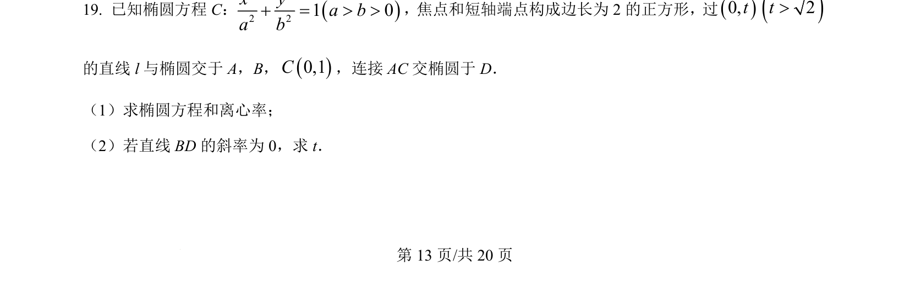
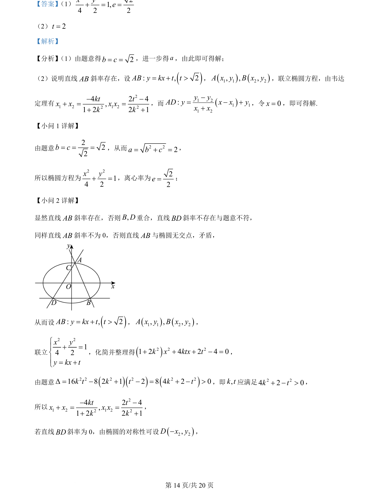
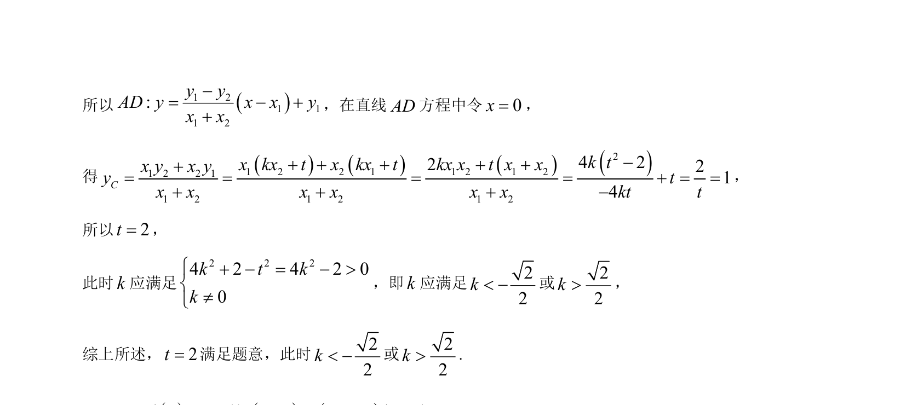

## 题面

## 摘要

本题主要考查椭圆标准方程、离心率的求解，以及直线与椭圆相交时韦达定理的应用和定点坐标的计算。

## 关联考点

- [[1316-椭圆的标准方程与几何性质|椭圆的标准方程与几何性质]]
- [[015-位置|直线与椭圆的位置关系]]
- [[234-韦达定理-初中|韦达定理]]

## 答案与解析

> 📄 原 PDF 第 13 页：`素材/真题/北京/2008-2024·（北京）数学高考真题/2024年高考数学试卷（北京）（解析卷）.pdf`
