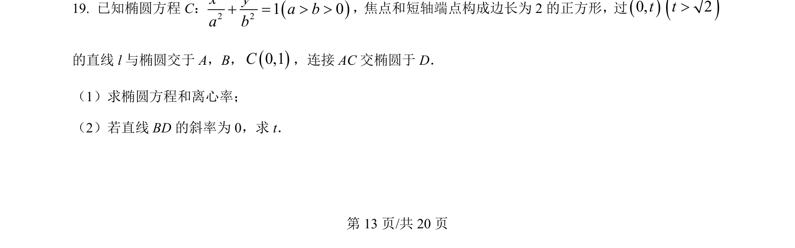
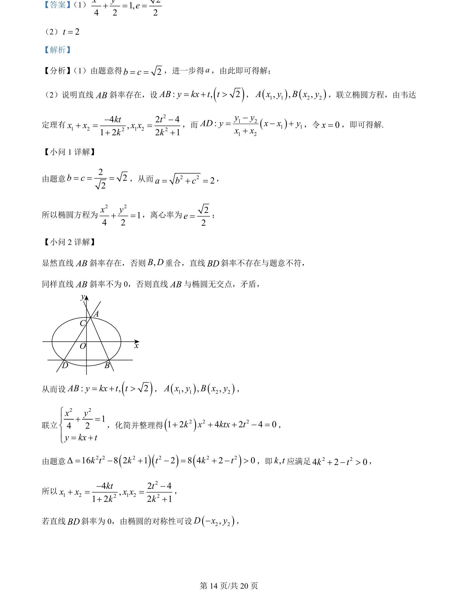
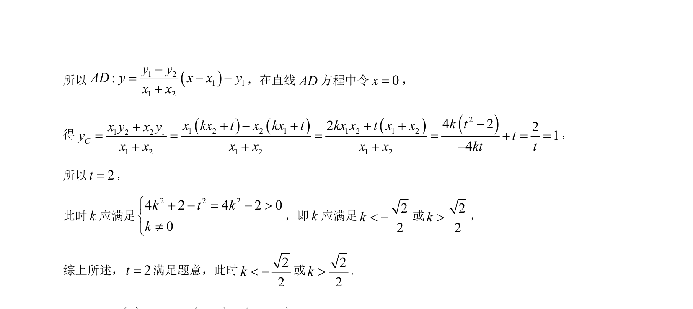

## 题面

## 摘要

本题主要考查椭圆标准方程、离心率的求解，以及直线与椭圆相交时韦达定理的应用和定点坐标的计算。

## 关联考点

- [[1315-椭圆的标准方程与几何性质|椭圆的标准方程与几何性质]]
- [[015-位置|直线与椭圆的位置关系]]
- [[234-韦达定理-初中|韦达定理]]

## 答案与解析

> 📄 原 PDF 第 13 页：`素材/真题/北京/2008-2024·（北京）数学高考真题/2024年高考数学试卷（北京）（解析卷）.pdf`

<!-- 题干文本-start -->
## 题干文本
19. 已知椭圆方程 C：2 22 21 0x ya ba b+ = > >， 焦点和短轴端点构成边长为2 的正方形，过0,t2t>
的直线 l与椭圆交于 A，B，0,1C，连接 AC交椭圆于 D．
（1）求椭圆方程和离心率；
（2）若直线 BD 的斜率为 0，求 t．
<!-- 题干文本-end -->

<!-- 解析文本-start -->
## 解析文本

<!-- 解析文本-end -->
