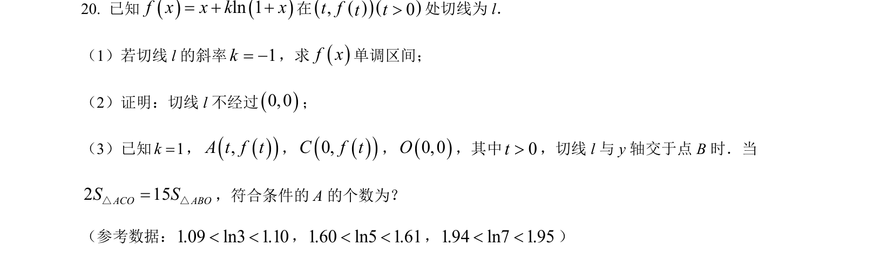
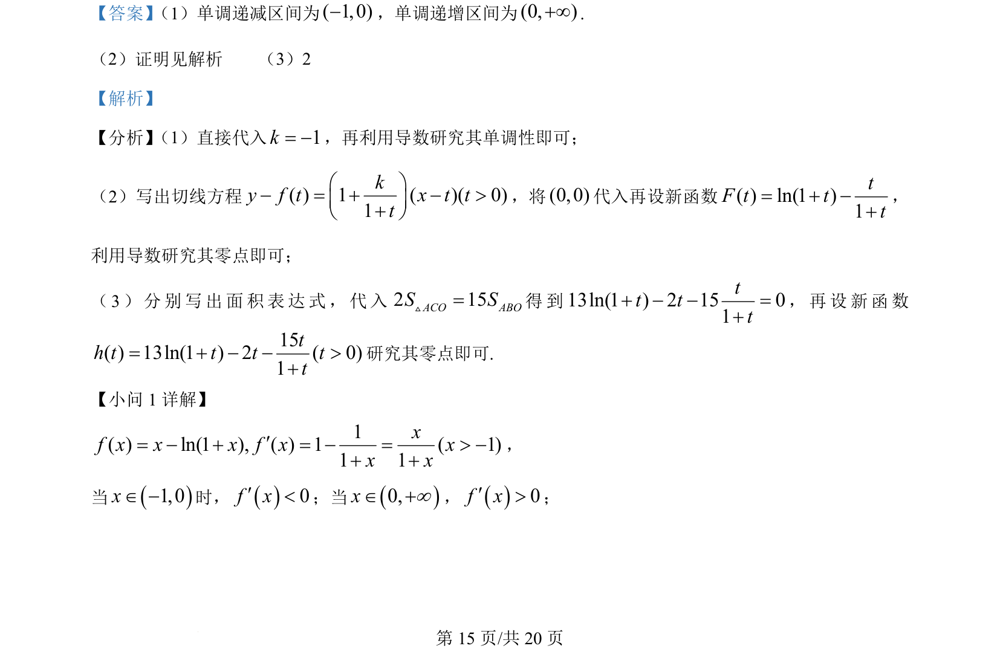
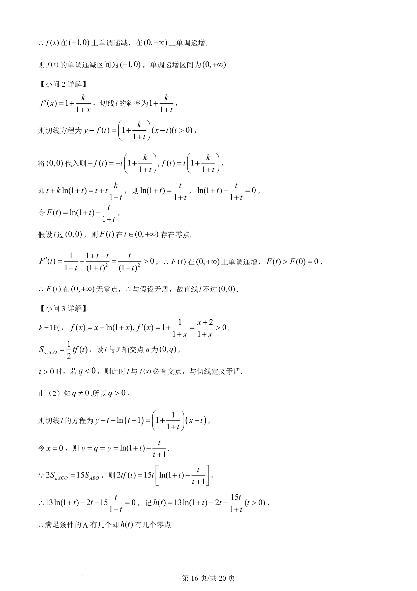
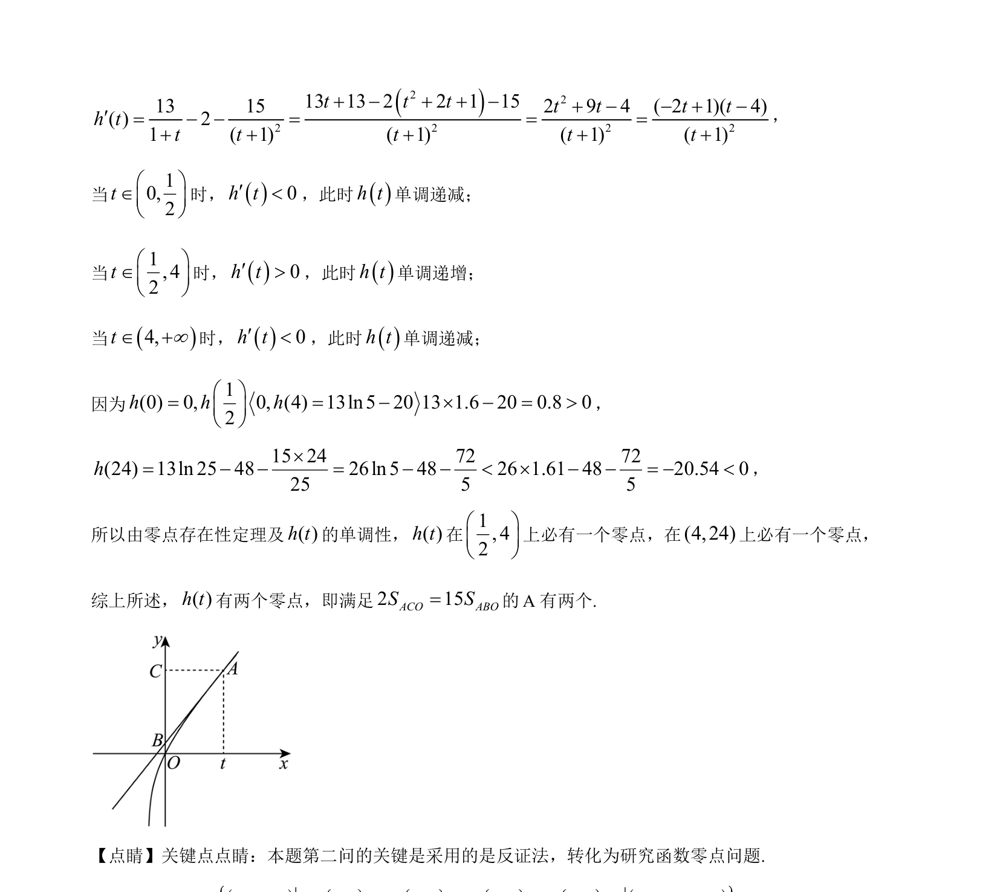

## 题面

## 摘要

本题考查利用导数研究含参函数的单调性、切线方程及零点问题，涉及构造函数与面积关系的转化。

## 关联考点

- [[导数研究单调性]]
- [[422-切线方程|切线方程]]
- [[导数研究零点]]
- [[923-构造函数|构造函数]]

## 答案与解析

> 📄 原 PDF 第 15 页：`素材/真题/北京/2008-2024·（北京）数学高考真题/2024年高考数学试卷（北京）（解析卷）.pdf`
