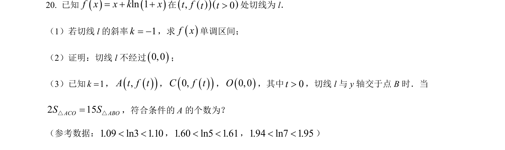
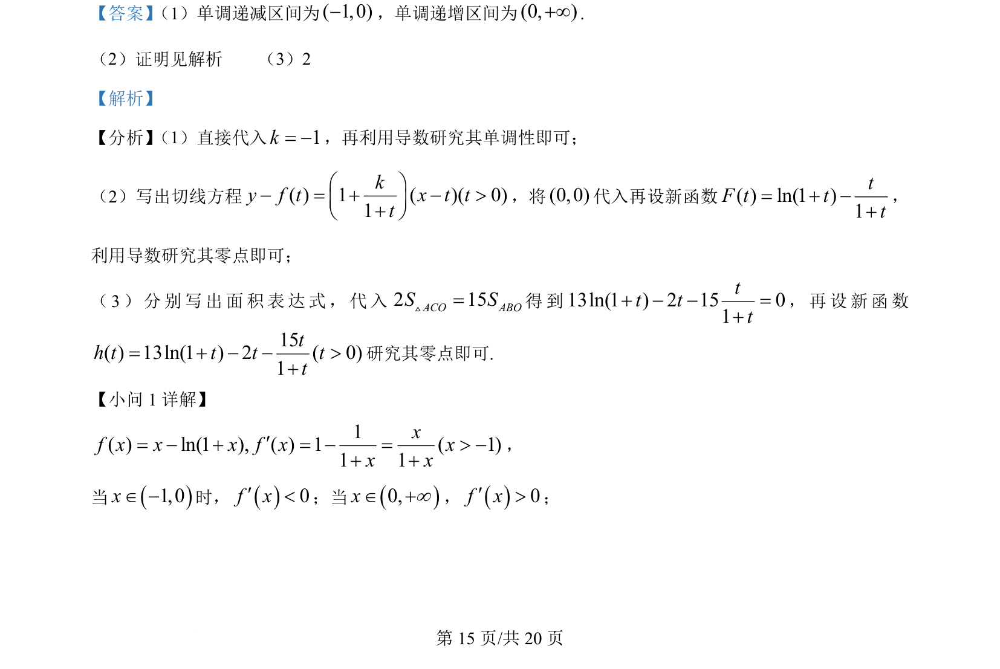
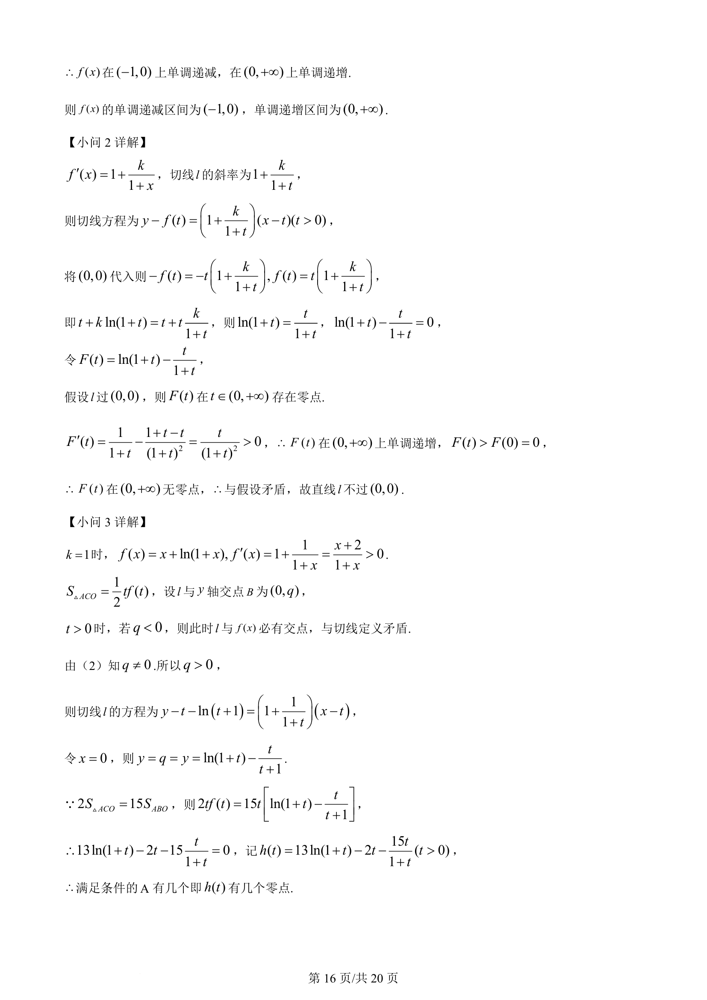
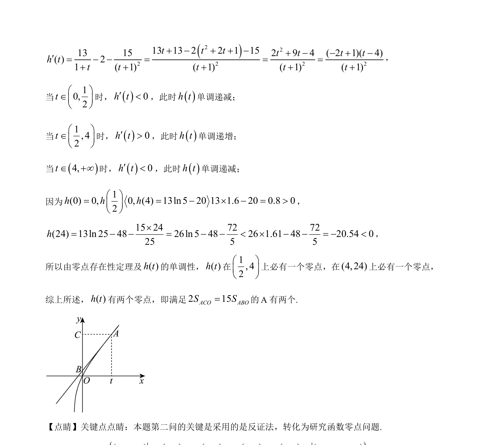

## 题面

## 摘要

本题考查利用导数研究含参函数的单调性、切线方程及零点问题，涉及构造函数与面积关系的转化。

## 关联考点

- [[导数研究单调性]]
- [[422-切线方程|切线方程]]
- [[导数研究零点]]
- [[923-构造函数|构造函数]]

## 答案与解析

> 📄 原 PDF 第 15 页：`素材/真题/北京/2008-2024·（北京）数学高考真题/2024年高考数学试卷（北京）（解析卷）.pdf`

<!-- 题干文本-start -->
## 题干文本
20. 已知ln 1f x x k x= + +在,0t ftt>处切线为 l．
（1）若切线 l的斜率1k= -，求f x单调区间；
（2）证明：切线 l不经过0,0；
（3）已知1k=，,A t f t，0,C f t，0,0O，其中0t>，切线 l与 y轴交于点 B时．当
2 15ACO ABOS S=△△，符合条件的 A的个数为？
（参考数据：1 .09 ln3 1 .10< <，1 .60 ln5 1 .61< <，1 .94 ln7 1 .95< <）
<!-- 题干文本-end -->

<!-- 解析文本-start -->
## 解析文本
【答案】 （1）单调递减区间为( 1,0)-，单调递增区间为(0, )+¥.    
（2）证明见解析    （3）2
【解析】
【分析】 （1）直接代入1k= -，再利用导数研究其单调性即可；
（2）写出切线方程( ) 1 ( )( 0)1ky f t x t ttæ ö- = + - >ç ÷+è ø
，将(0,0)代入再设新函数( ) ln(1 )1tF t tt= + -+
，
利用导数研究其零点即可；
（ 3）分别写出面积表达式，代入2 15ACO ABOS S=V得 到13ln(1 ) 2 15 01tt tt+ - - =+
， 再 设 新 函 数
15( ) 13ln(1 ) 2 ( 0)1th t t t tt= + - - >+
研究其零点即可.
【小问 1 详解】
1( ) ln(1 ), ( ) 1 ( 1)1 1xf x x x f x xx x¢= - + = - = > -+ +
，
当1,0xÎ -时，0f x¢<；当0,x¥Î +，0f x¢>；
<!-- 解析文本-end -->
