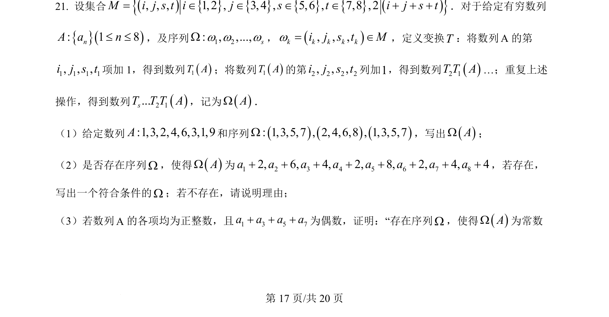
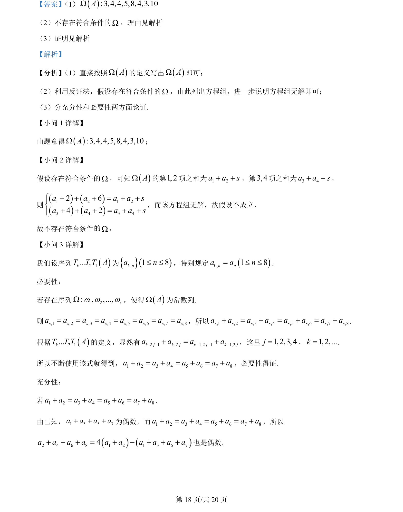
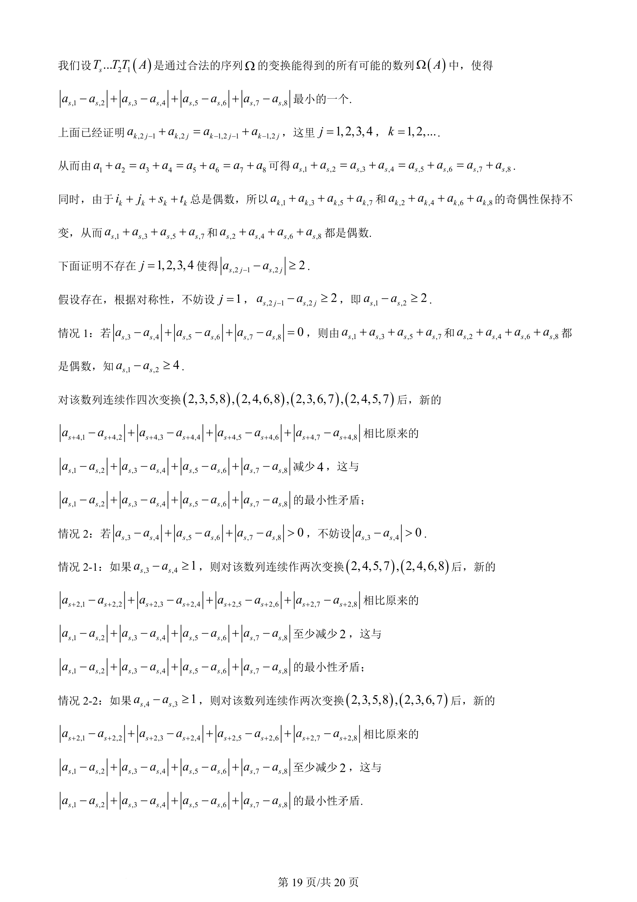
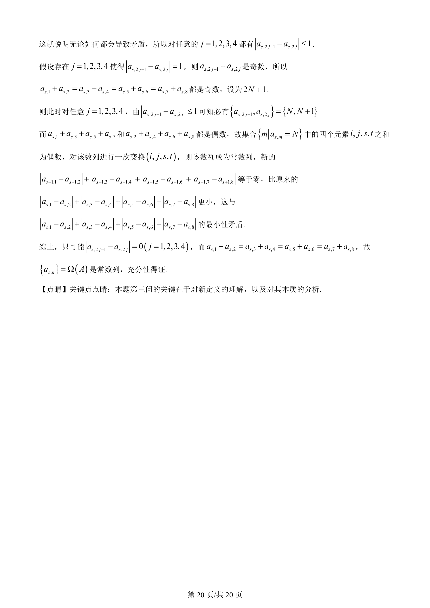

## 题面

## 摘要

考查自定义数列变换规则下的存在性论证，涉及反证法与充要条件推演

## 关联考点

- [[数列变换]]
- [[1180-反证法|反证法]]
- [[充分必要性]]
- [[奇偶性分析]]

## 答案与解析

> 📄 原 PDF 第 17 页：`素材/真题/北京/2008-2024·（北京）数学高考真题/2024年高考数学试卷（北京）（解析卷）.pdf`
