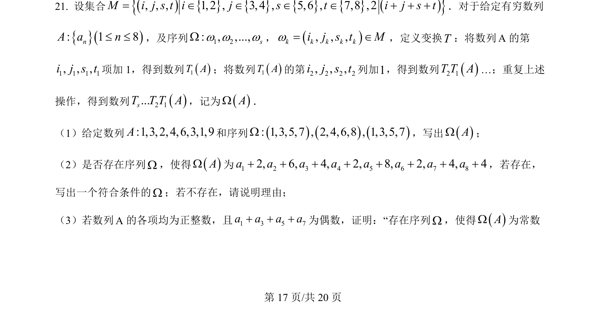
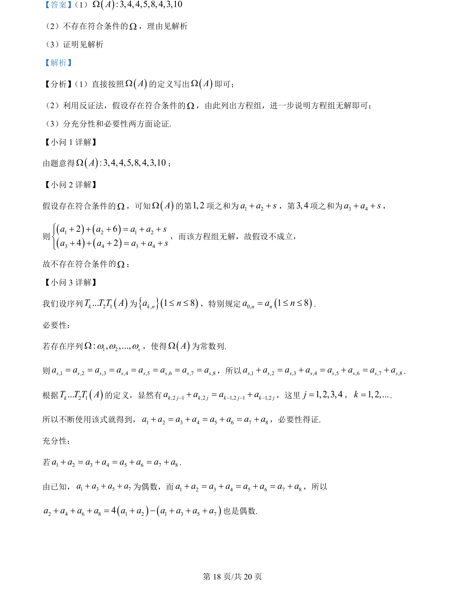
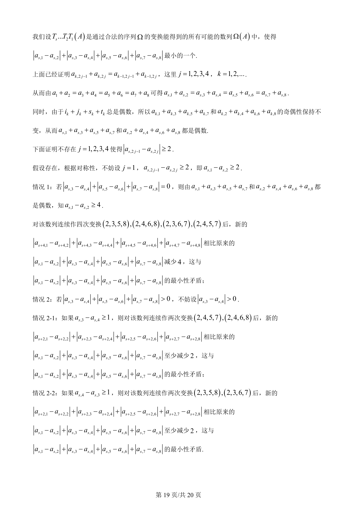
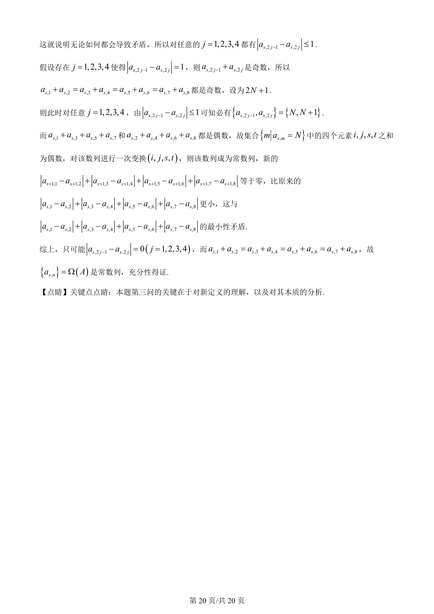

## 题面

## 摘要

考查自定义数列变换规则下的存在性论证，涉及反证法与充要条件推演

## 关联考点

- [[数列变换]]
- [[1179-反证法|反证法]]
- [[充分必要性]]
- [[1377-奇偶性分析|奇偶性分析]]

## 答案与解析

> 📄 原 PDF 第 17 页：`素材/真题/北京/2008-2024·（北京）数学高考真题/2024年高考数学试卷（北京）（解析卷）.pdf`

<!-- 题干文本-start -->
## 题干文本
21. 设集合, , , 1, 2 , 3, 4 , 5,6 , 7,8 , 2M i j s t i j s t i j s t= Î Î Î Î + + +．对于给定有穷数列
: 1 8nA a n£ £，及序列1 2: , ,...,sw w wW，, , ,k k k k ki j s t Mw= Î，定义变换T：将数列A的第
1 1 1 1, , ,i j s t项加 1，得到数列1TA；将数列1TA的第2 2 2 2, , ,i j s t列加1，得到数列2 1T T A…；重复上述
操作，得到数列2 1...sT T T A，记为AW．
（1）给定数列:1,3, 2, 4,6,3,1,9A和序列: 1,3,5,7 , 2, 4,6,8 , 1,3,5,7W，写出AW；
（2）是否存在序列W，使得AW为1 2 3 4 5 6 7 82, 6, 4, 2, 8, 2, 4, 4a a a a a a a a+ + + + + + + +，若存在，
写出一个符合条件的W；若不存在，请说明理由；
（3）若数列A的各项均为正整数，且1 3 5 7a a a a+ + +为偶数，证明：“存在序列W，使得AW为常数
<!-- 题干文本-end -->

<!-- 解析文本-start -->
## 解析文本

<!-- 解析文本-end -->
