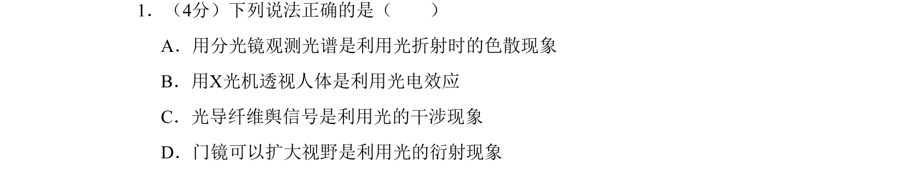

## 题面

## 摘要

本题考查光的色散、光电效应、全反射、干涉和衍射等光学现象在技术中的应用。

## 关联考点

- [[005-光的色散|光的色散]]
- [[417-光电效应|光电效应]]
- [[340-光的干涉|光的干涉]]
- [[342-光的衍射-高中|光的衍射]]

## 答案与解析

> 📄 原 PDF 第 1 页：`素材/真题/北京/2008-2024·（北京）物理高考真题/2008年高考物理试卷（北京）（解析卷）.pdf`

<!-- 题干文本-start -->
## 题干文本
1．（4分）下列说法正确的是（　　）
A．用分光镜观测光谱是利用光折射时的色散现象
B．用X光机透视人体是利用光电效应
C．光导纤维舆信号是利用光的干涉现象
D．门镜可以扩大视野是利用光的衍射现象
<!-- 题干文本-end -->

<!-- 解析文本-start -->
## 解析文本

<!-- 解析文本-end -->
