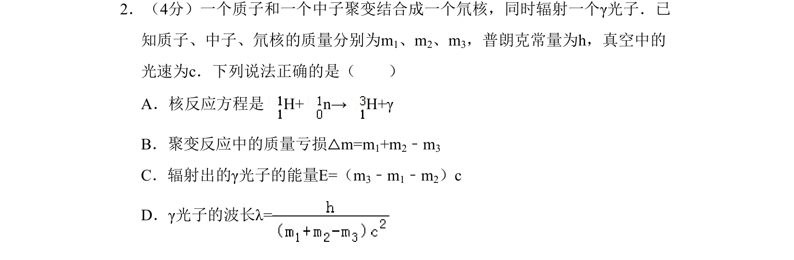

## 题面

## 摘要

该题考查轻核聚变反应方程书写、质量亏损计算及γ光子能量与波长的关系。

## 关联考点

- [[629-核反应方程|核反应方程]]
- [[449-质能方程|质量亏损]]
- [[453-光子能量|光子能量]]
- [[德布罗意波长]]

## 答案与解析

> 📄 原 PDF 第 1 页：`素材/真题/北京/2008-2024·（北京）物理高考真题/2008年高考物理试卷（北京）（解析卷）.pdf`
