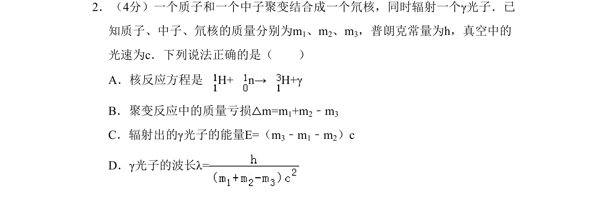

## 题面

## 摘要

该题考查轻核聚变反应方程书写、质量亏损计算及γ光子能量与波长的关系。

## 关联考点

- [[629-核反应方程|核反应方程]]
- [[449-质能方程|质量亏损]]
- [[453-光子能量|光子能量]]
- [[德布罗意波长]]

## 答案与解析

> 📄 原 PDF 第 1 页：`素材/真题/北京/2008-2024·（北京）物理高考真题/2008年高考物理试卷（北京）（解析卷）.pdf`

<!-- 题干文本-start -->
## 题干文本
2．（4分）一个质子和一个中子聚变结合成一个氘核，同时辐射一个γ光子．已
知质子、中子、氘核的质量分别为m1、m2、m3，普朗克常量为h，真空中的
光速为c．下列说法正确的是（　　）
A．核反应方程是H+n→H+γ
B．聚变反应中的质量亏损△m=m1+m2﹣m3
C．辐射出的γ光子的能量E=（m3﹣m1﹣m2）c
D．γ光子的波长λ=
<!-- 题干文本-end -->

<!-- 解析文本-start -->
## 解析文本

<!-- 解析文本-end -->
