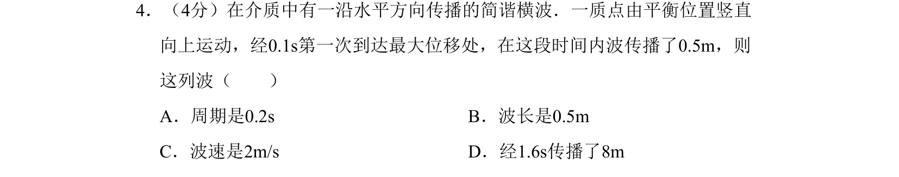

## 题面

## 摘要

简谐横波中质点振动时间与波传播距离的关系，计算周期、波长和波速。

## 关联考点

- [[713-简谐横波|简谐横波]]
- [[261-周期|周期]]
- [[370-波长|波长]]
- [[369-波速|波速]]

## 答案与解析

> 📄 原 PDF 第 1 页：`素材/真题/北京/2008-2024·（北京）物理高考真题/2008年高考物理试卷（北京）（解析卷）.pdf`
