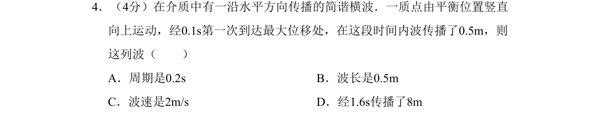

## 题面

## 摘要

简谐横波中质点振动时间与波传播距离的关系，计算周期、波长和波速。

## 关联考点

- [[713-简谐横波|简谐横波]]
- [[261-周期|周期]]
- [[370-波长|波长]]
- [[369-波速|波速]]

## 答案与解析

> 📄 原 PDF 第 1 页：`素材/真题/北京/2008-2024·（北京）物理高考真题/2008年高考物理试卷（北京）（解析卷）.pdf`

<!-- 题干文本-start -->
## 题干文本
4．（4分）在介质中有一沿水平方向传播的简谐横波．一质点由平衡位置竖直
向上运动，经0.1s第一次到达最大位移处，在这段时间内波传播了0.5m，则
这列波（　　）
A．周期是0.2s B．波长是0.5m
C．波速是2m/s D．经1.6s传播了8m
<!-- 题干文本-end -->

<!-- 解析文本-start -->
## 解析文本

<!-- 解析文本-end -->
