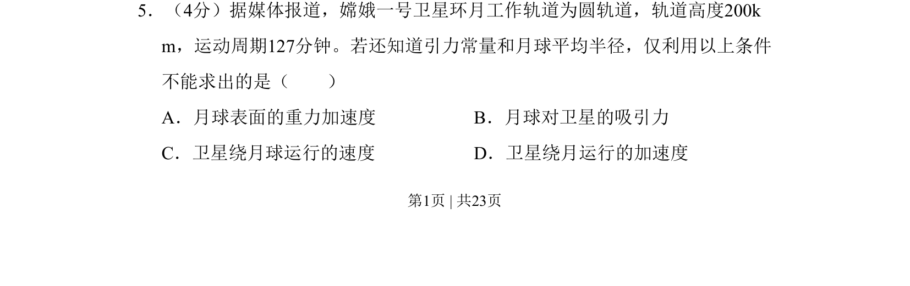

## 题面

## 摘要

根据卫星轨道参数和月球半径判断在已知引力常量情况下无法求解的物理量

## 关联考点

- [[246-万有引力定律|万有引力定律]]
- [[572-圆周运动向心力|圆周运动向心力]]
- [[115-重力加速度-初中|重力加速度]]
- [[卫星速度]]

## 答案与解析

> 📄 原 PDF 第 1 页：`素材/真题/北京/2008-2024·（北京）物理高考真题/2008年高考物理试卷（北京）（解析卷）.pdf`
