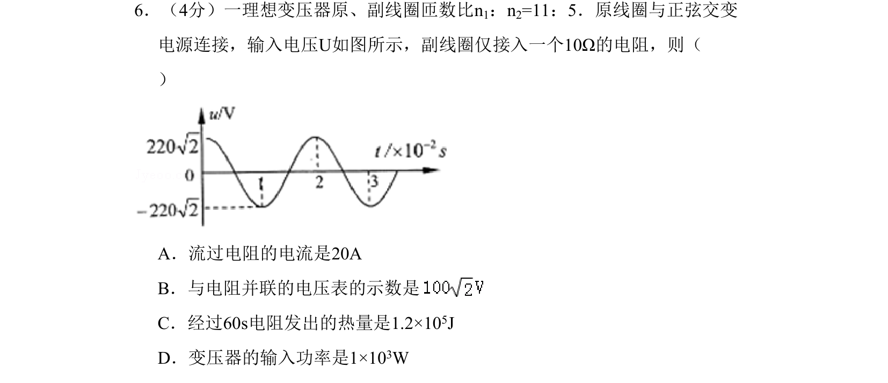

## 题面

## 摘要

理想变压器结合交流电有效值，计算副边电压、电流、功率及热量。

## 关联考点

- [[398-理想变压器|理想变压器]]
- [[835-交流电有效值|交流电有效值]]
- [[159-电功率|电功率]]
- [[154-焦耳定律|焦耳定律]]

## 答案与解析

> 📄 原 PDF 第 2 页：`素材/真题/北京/2008-2024·（北京）物理高考真题/2008年高考物理试卷（北京）（解析卷）.pdf`

<!-- 题干文本-start -->
## 题干文本
6．（4分）一理想变压器原、副线圈匝数比n1：n2=11：5．原线圈与正弦交变
电源连接，输入电压U如图所示，副线圈仅接入一个10Ω的电阻，则（　　
）
A．流过电阻的电流是20A
B．与电阻并联的电压表的示数是
C．经过60s电阻发出的热量是1.2×105J
D．变压器的输入功率是1×103W
<!-- 题干文本-end -->

<!-- 解析文本-start -->
## 解析文本

<!-- 解析文本-end -->
