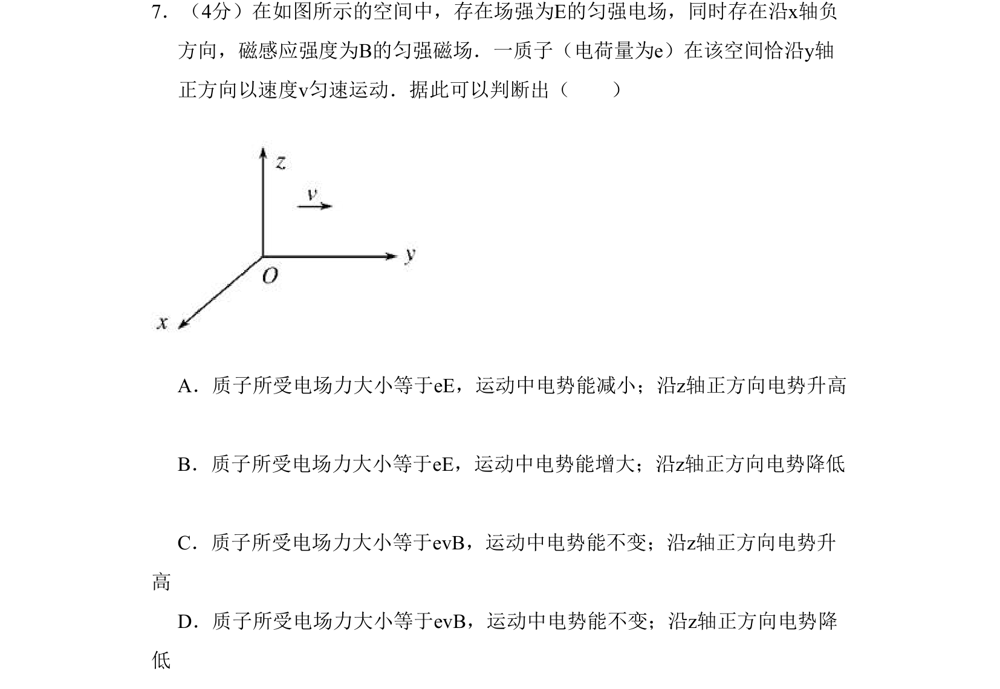

## 题面

## 摘要

质子匀速运动时电场力等于洛伦兹力，考查电势能与电势升降的判断。

## 关联考点

- [[844-带电粒子在复合场中的运动|带电粒子在复合场中的运动]]
- [[304-洛伦兹力|洛伦兹力]]
- [[电场力与电势能]]
- [[电势升降]]

## 答案与解析

> 📄 原 PDF 第 2 页：`素材/真题/北京/2008-2024·（北京）物理高考真题/2008年高考物理试卷（北京）（解析卷）.pdf`
