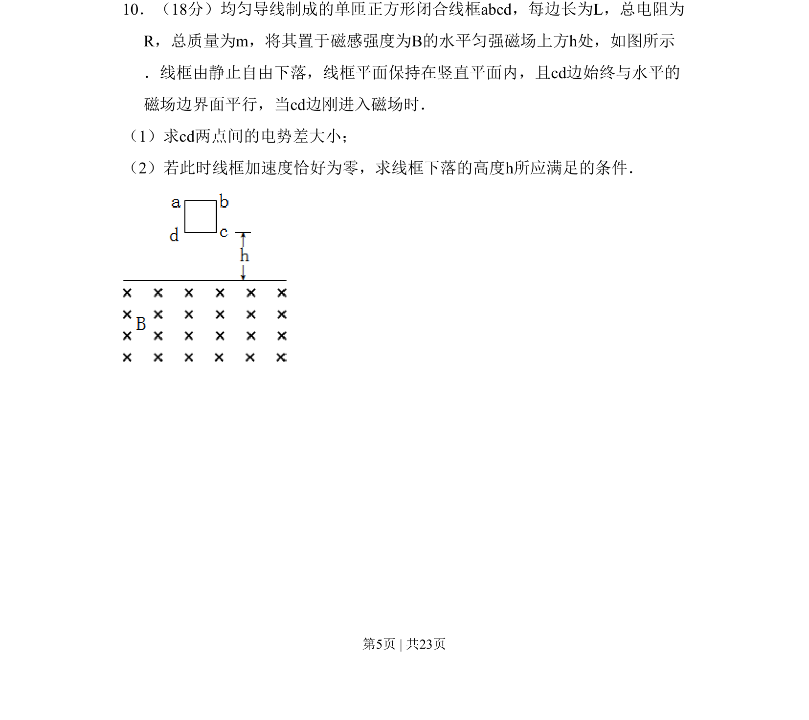

## 题面

## 摘要

线框自由下落进入匀强磁场，求cd边刚进入时电势差及加速度为零时的下落高度条件。

## 关联考点

- [[175-电磁感应|电磁感应]]
- [[141-欧姆定律-初中|欧姆定律]]
- [[188-磁场对通电导体的作用|安培力]]
- [[215-匀变速直线运动|匀变速直线运动]]

## 答案与解析

> 📄 原 PDF 第 5 页：`素材/真题/北京/2008-2024·（北京）物理高考真题/2008年高考物理试卷（北京）（解析卷）.pdf`
