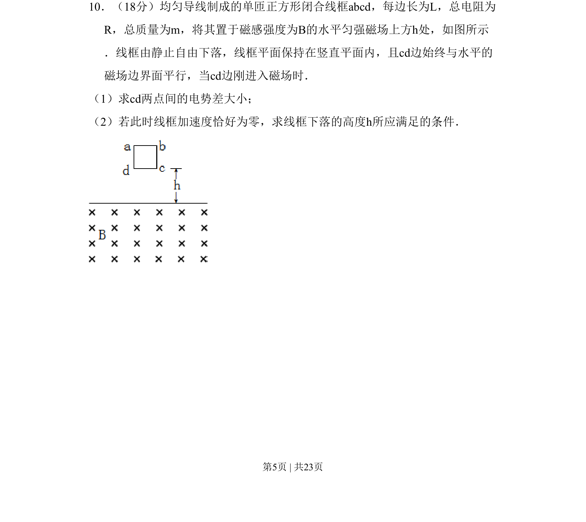

## 题面

## 摘要

线框自由下落进入匀强磁场，求cd边刚进入时电势差及加速度为零时的下落高度条件。

## 关联考点

- [[175-电磁感应|电磁感应]]
- [[141-欧姆定律-初中|欧姆定律]]
- [[188-磁场对通电导体的作用|安培力]]
- [[215-匀变速直线运动|匀变速直线运动]]

## 答案与解析

> 📄 原 PDF 第 5 页：`素材/真题/北京/2008-2024·（北京）物理高考真题/2008年高考物理试卷（北京）（解析卷）.pdf`

<!-- 题干文本-start -->
## 题干文本
10．（18分）均匀导线制成的单匝正方形闭合线框abcd，每边长为L，总电阻为
R，总质量为m，将其置于磁感强度为B的水平匀强磁场上方h处，如图所示
．线框由静止自由下落，线框平面保持在竖直平面内，且cd边始终与水平的
磁场边界面平行，当cd边刚进入磁场时．
（1）求cd两点间的电势差大小；
（2）若此时线框加速度恰好为零，求线框下落的高度h所应满足的条件．
<!-- 题干文本-end -->

<!-- 解析文本-start -->
## 解析文本

<!-- 解析文本-end -->
