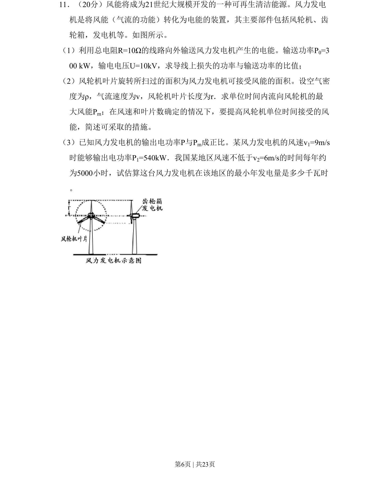

## 题面

## 摘要

风能发电综合应用，包含远距离输电功率损失、流体动能模型与风能捕获、年发电量估算。

## 关联考点

- [[电功率损失]]
- [[251-动能定理|动能定理]]
- [[448-能量转化效率|能量转化效率]]
- [[建模估算]]

## 答案与解析

> 📄 原 PDF 第 6 页：`素材/真题/北京/2008-2024·（北京）物理高考真题/2008年高考物理试卷（北京）（解析卷）.pdf`
