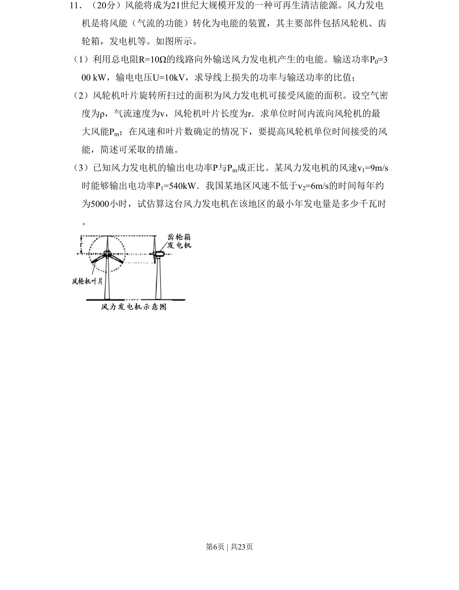

## 题面

## 摘要

风能发电综合应用，包含远距离输电功率损失、流体动能模型与风能捕获、年发电量估算。

## 关联考点

- [[电功率损失]]
- [[251-动能定理|动能定理]]
- [[448-能量转化效率|能量转化效率]]
- [[建模估算]]

## 答案与解析

> 📄 原 PDF 第 6 页：`素材/真题/北京/2008-2024·（北京）物理高考真题/2008年高考物理试卷（北京）（解析卷）.pdf`

<!-- 题干文本-start -->
## 题干文本
11．（20分）风能将成为21世纪大规模开发的一种可再生清洁能源。风力发电
机是将风能（气流的功能）转化为电能的装置，其主要部件包括风轮机、齿
轮箱，发电机等。如图所示。
（1）利用总电阻R=10Ω的线路向外输送风力发电机产生的电能。输送功率P0=3
00 kW，输电电压U=10kV，求导线上损失的功率与输送功率的比值；
（2）风轮机叶片旋转所扫过的面积为风力发电机可接受风能的面积。设空气密
度为ρ，气流速度为v，风轮机叶片长度为r．求单位时间内流向风轮机的最
大风能Pm；在风速和叶片数确定的情况下，要提高风轮机单位时间接受的风
能，简述可采取的措施。
（3）已知风力发电机的输出电功率P与Pm成正比。某风力发电机的风速v1=9m/s
时能够输出电功率P1=540kW．我国某地区风速不低于v2=6m/s的时间每年约
为5000小时，试估算这台风力发电机在该地区的最小年发电量是多少千瓦时
。
<!-- 题干文本-end -->

<!-- 解析文本-start -->
## 解析文本

<!-- 解析文本-end -->
