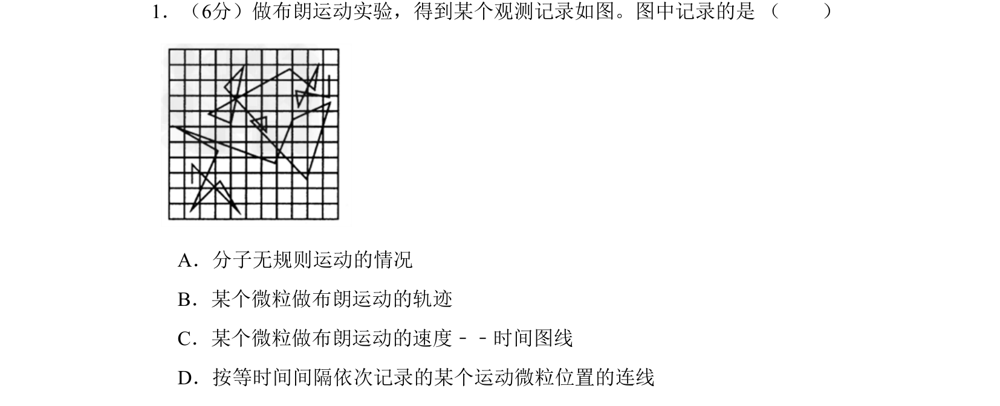

## 题面

## 摘要

本题考查布朗运动实验中对微粒位置记录的理解，图中连线并非运动轨迹。

## 关联考点

- [[130-分子热运动|布朗运动]]
- [[微粒位置连线]]
- [[运动轨迹辨析]]

## 答案与解析

> 📄 原 PDF 第 1 页：`素材/真题/北京/2008-2024·（北京）物理高考真题/2009年高考物理试卷（北京）（解析卷）.pdf`

<!-- 题干文本-start -->
## 题干文本
1．（6分）做布朗运动实验，得到某个观测记录如图。图中记录的是 （　　）
  
A．分子无规则运动的情况
B．某个微粒做布朗运动的轨迹
C．某个微粒做布朗运动的速度﹣﹣时间图线
D．按等时间间隔依次记录的某个运动微粒位置的连线
<!-- 题干文本-end -->

<!-- 解析文本-start -->
## 解析文本

<!-- 解析文本-end -->
