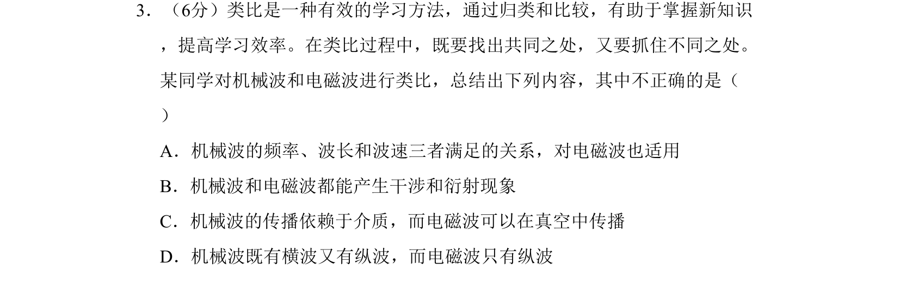

## 题面

## 摘要

考查机械波与电磁波的异同，包括波速公式、干涉衍射、传播介质及波的类型。

## 关联考点

- [[362-机械波|机械波]]
- [[176-电磁波|电磁波]]
- [[363-横波与纵波|横波与纵波]]
- [[干涉与衍射]]

## 答案与解析

> 📄 原 PDF 第 1 页：`素材/真题/北京/2008-2024·（北京）物理高考真题/2009年高考物理试卷（北京）（解析卷）.pdf`
