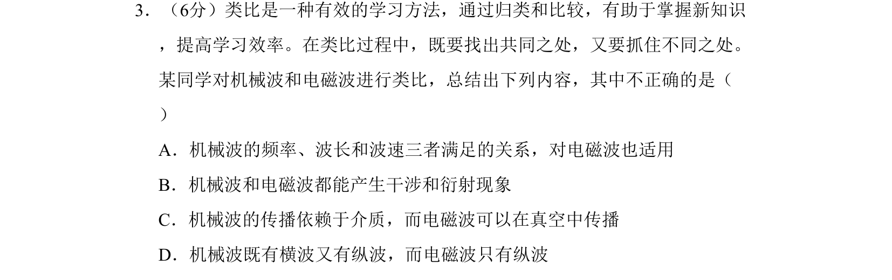

## 题面

## 摘要

考查机械波与电磁波的异同，包括波速公式、干涉衍射、传播介质及波的类型。

## 关联考点

- [[362-机械波|机械波]]
- [[176-电磁波|电磁波]]
- [[363-横波与纵波|横波与纵波]]
- [[干涉与衍射]]

## 答案与解析

> 📄 原 PDF 第 1 页：`素材/真题/北京/2008-2024·（北京）物理高考真题/2009年高考物理试卷（北京）（解析卷）.pdf`

<!-- 题干文本-start -->
## 题干文本
3．（6分）类比是一种有效的学习方法，通过归类和比较，有助于掌握新知识
，提高学习效率。在类比过程中，既要找出共同之处，又要抓住不同之处。
某同学对机械波和电磁波进行类比，总结出下列内容，其中不正确的是（　　
）
A．机械波的频率、波长和波速三者满足的关系，对电磁波也适用
B．机械波和电磁波都能产生干涉和衍射现象
C．机械波的传播依赖于介质，而电磁波可以在真空中传播
D．机械波既有横波又有纵波，而电磁波只有纵波
<!-- 题干文本-end -->

<!-- 解析文本-start -->
## 解析文本

<!-- 解析文本-end -->
