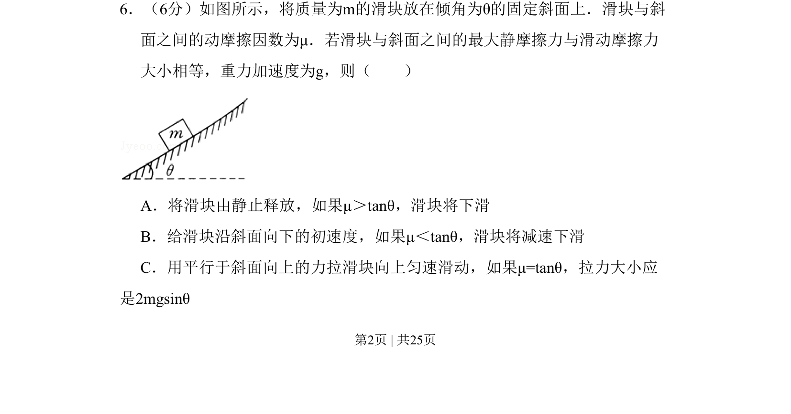
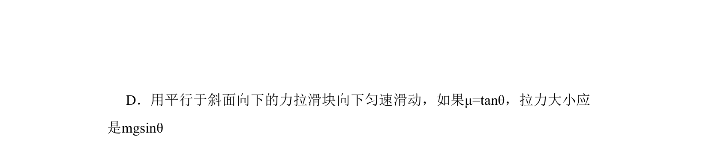

## 题面

## 摘要

考查斜面滑块模型中静摩擦力、滑动摩擦力与下滑条件及受力平衡的分析。

## 关联考点

- [[081-摩擦力|摩擦力]]
- [[533-力的平衡|力的平衡]]
- [[斜面模型]]

## 答案与解析

> 📄 原 PDF 第 2 页：`素材/真题/北京/2008-2024·（北京）物理高考真题/2009年高考物理试卷（北京）（解析卷）.pdf`

<!-- 题干文本-start -->
## 题干文本
6．（6分）如图所示，将质量为m的滑块放在倾角为θ的固定斜面上．滑块与斜
面之间的动摩擦因数为μ．若滑块与斜面之间的最大静摩擦力与滑动摩擦力
大小相等，重力加速度为g，则（　　）
A．将滑块由静止释放，如果μ＞tanθ，滑块将下滑
B．给滑块沿斜面向下的初速度，如果μ＜tanθ，滑块将减速下滑
C．用平行于斜面向上的力拉滑块向上匀速滑动，如果μ=tanθ，拉力大小应
是2mgsinθ
<!-- 题干文本-end -->

<!-- 解析文本-start -->
## 解析文本

<!-- 解析文本-end -->
