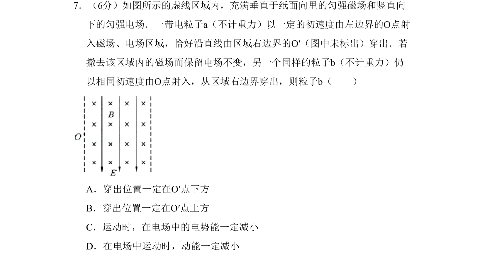

## 题面

## 摘要

带电粒子在正交匀强电场和磁场中的直线运动及仅电场下的偏转问题，考查速度选择器原理和电场力做功。

## 关联考点

- [[302-带电粒子复合场运动|速度选择器]]
- [[带电粒子在复合场中的运动]]
- [[673-电场力做功|电场力做功]]
- [[电势能变化]]

## 答案与解析

> 📄 原 PDF 第 3 页：`素材/真题/北京/2008-2024·（北京）物理高考真题/2009年高考物理试卷（北京）（解析卷）.pdf`
